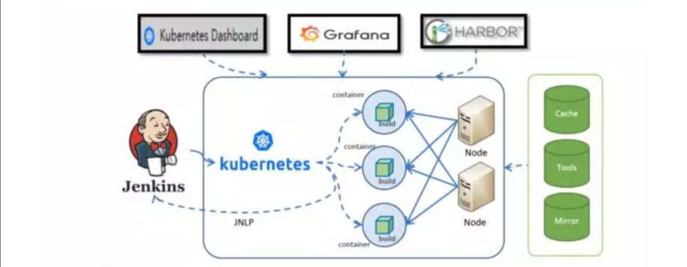

# 基础概念

## JNLP(了解比较少)
jnlp: Java Network Launching Protocol (JNLP，java网络加载协议) ，通过JCP(Java Community Process)的JSR-56的开发， JNLP解决了很多先前用java开发针对客户端的功能的问题。一个JNLP客户端是一个应用程序或者说服务，它可以从宿主于网络的资源中加载应用程序

## jenkins启动slave方式:
###传统的Jenkins Master/Slave架构：
Master/Slave相当于Server和agent的概念。Master提供web接口让用户来管理job和slave，job可以运行在master本机或者被分配到slave上运行。一个master可以关联多个slave用来为不同的job或相同的job的不同配置来服务。
###master和slave连接方式：
(1)master通过ssh来启动slave：
Jenkins配置ssh插件，可以用来与远程的sshd通信，从而启动slave agent，这是对linux系统的slave最方便的方法。在创建ssh连接的slave的时候，你需要提供slave的host名字，用户名和ssh证书。创建public/private keys，然后将public key拷贝到slave的~/.ssh/authorized_keys中，将private key 保存到master上某ppk文件中。jenkins将会自动地完成其他的配置工作，例如copy slave agent的binary，启动和停止slave。但是job运行所依赖其他的项目需要自己设置。
(2)通过jnlp启动代理：
基于java web start的jnlp的连接（等等）
存在的问题：
(1) slave很多的情况下，空闲的slave节点也很多
(2) 队列中等待构建的job也很多(指定的jobs直接绑定到指定的slave,这时候executor的数量觉得并发的构建量)
(3) 会存在一些构建失败，workspace空间不足问题（slave上构建的workspace的遗留，占用大规模空间）等等

###kubernetes Master/Slave架构


Jenkins使用k8s插件，我们所有的编译环境通过插件在Node上建立一个容器，这个容器挂载为Jenkins的一个slave。

####Jenkins+k8s的优点：

 - 容器化(环境标准化，隔离性，版本，可移植性等等)
 - 容器Slave按弹性收缩，自动创建，使用，销毁
 - 资源共享(所有容器slave可以共享k8s集群)
 - 并发量
####缺点：k8s集群高可用，Jenkins master节点的高可用

Jenkins helm chart特点参数(Based on Jenkins helm chart version 1.4.1)：
 - master.numExecutors：master执行构建的数目
 - master.useSecurity: 默认true(代表配置自动加载)
 - master.securityRealm: 自定义安全领域
 - master.authorizationStrategy: xml for AuthorizationStrategy
 - master.disabledAgentProtocols: 默认值 JNLP-connect,JNLP2-connect(过时，禁用)
 - master.csrf.defaultCrumbIssuser.enabled: 默认true
   master.csrf.defaultCrumbIssuer.proxyCompatability: 默认true(如果需要调用Jenkins API则需要把这两个值置成false)
 - master.jmxPort： port for jmx(jmx,压测，性能报告，可以定时)
 - master.backendconfig.enabled
   master.backendconfig.apiVersion	
   master.backendconfig.name
   master.backendconfig.annotations
   master.backendconfig.labels	
   master.backendconfig.spec
   (BackendConfig,GKE(google kubernetes engine) 自定义资源的测试版)
 - master.jenkinsUrlProtocol: set https if master.ingress.tls,http otherwise 
 - master.JCasC.enabled: jenkins configuration as code (配置即代码)，默认是false
 - master.sidecars.configAutoReload	
   master.sidecars.configAutoReload.enabled	
   master.sidecars.configAutoReload.image
   master.sidecars.others
   (配置sidecars)
 - master.initScripts: 初始化脚本，可以自定义初始化脚本覆盖原来默认的
 - master.credentialsXmlSecret：Kubernetes secret that contains a 'credentials.xml' file
   master.secretsFilesSecret：Kubernetes secret that contains 'secrets' files
 - master.jobs：可以指定jobs config
 - master.installPlugins: jenkins启动默认安装的插件
 - master.prometheus.enabled	Enables prometheus service monitor	false
   master.prometheus.serviceMonitorAdditionalLabels	Additional labels to add to the service monitor object	{}
   master.prometheus.scrapeInterval	How often prometheus should scrape metrics	60s
   master.prometheus.scrapeEndpoint	The endpoint prometheus should get metrics from	/prometheus
   master.prometheus.alertingrules	Array of prometheus alerting rules	[]
   master.prometheus.alertingRulesAdditionalLabels
   (jenkins配置prometheus)
 - rbac.create：true 创建rbac
 - serviceAccount.name: k8s sa 名字
 - serviceAccountAgent.name: agent sa name
 - master.enableRawHtmlMarkupFormatter: 默认fasle,一些第三方系统，可以使用html页面发送给Jenkins webhook,set true

#### Configuratin as Code
```
configScripts:
  ldap-settings: |
    jenkins:
      securityRealm:
        ldap:
          configurations:
            configurations:
              - server: ldap.acme.com
                rootDN: dc=acme,dc=uk
                managerPasswordSecret: ${LDAP_PASSWORD}
              - groupMembershipStrategy:
                  fromUserRecord:
                    attributeName: "memberOf"
```
通过Jenkins Configuration as Code Pugin ,在Jenkins启动时脚本中每个key将会变成一个配置yaml,放在master的/var/jenkins_home/casc_configs下。