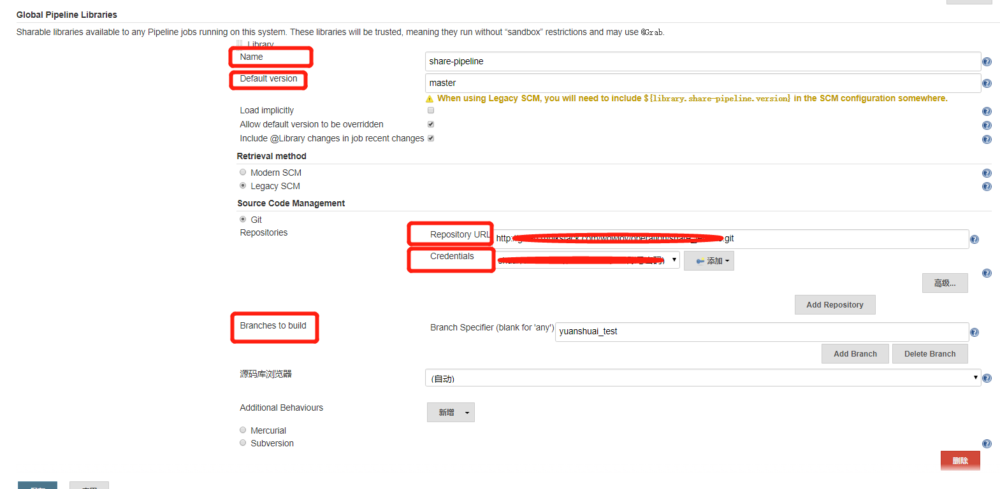
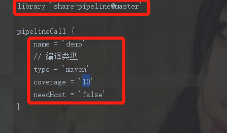
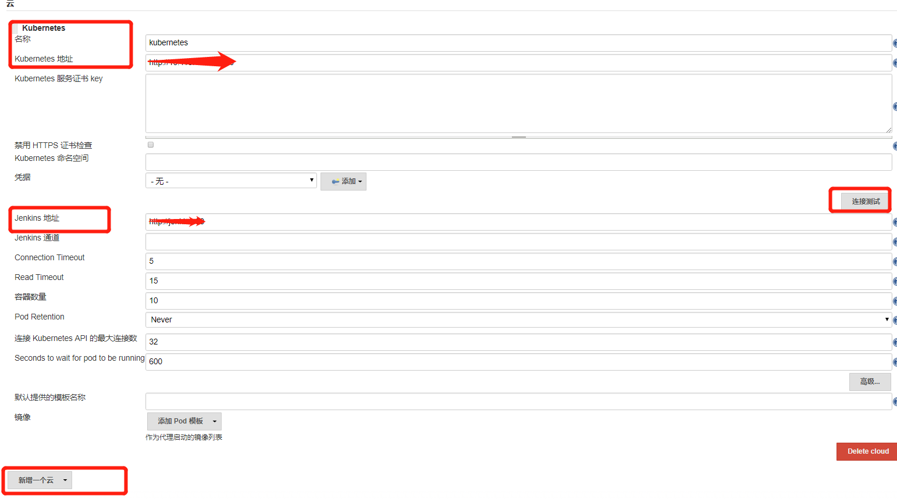
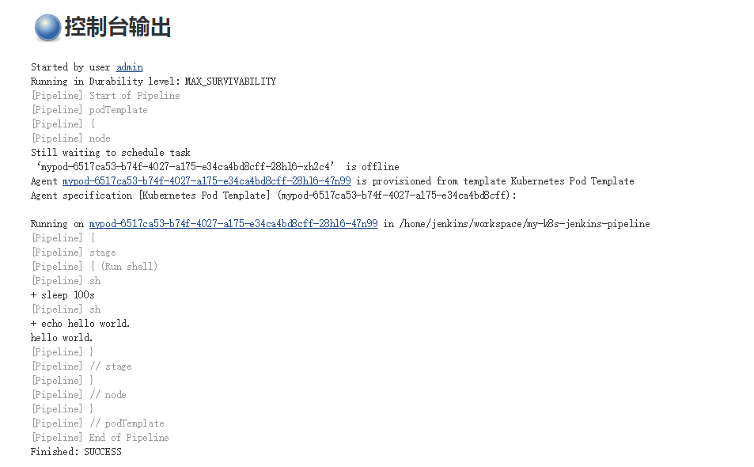
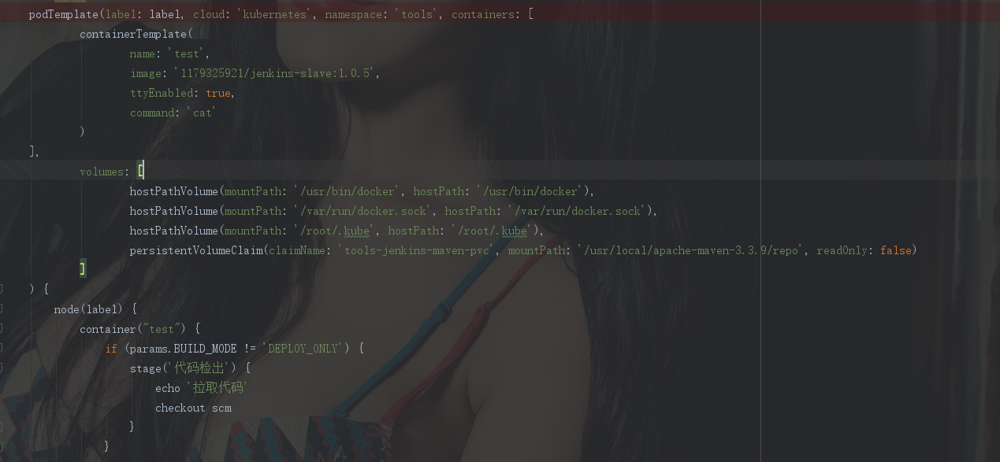
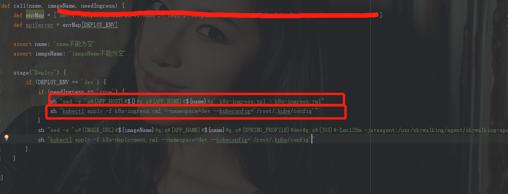
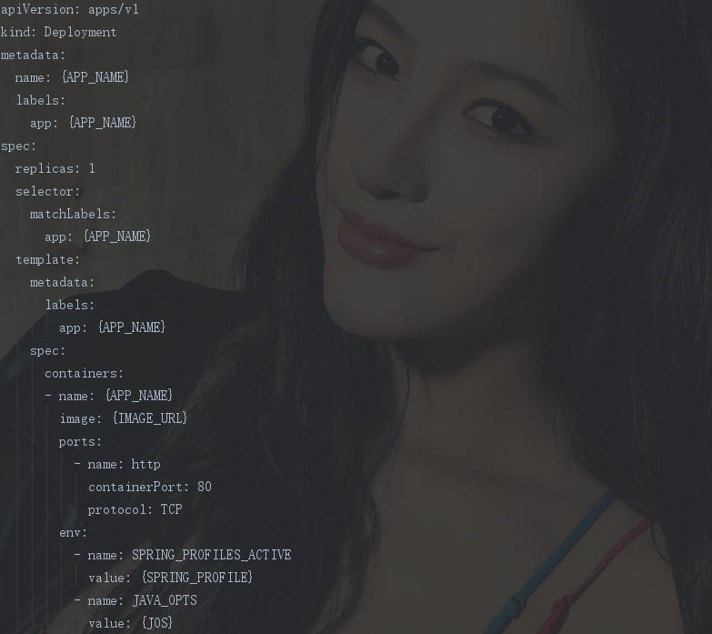
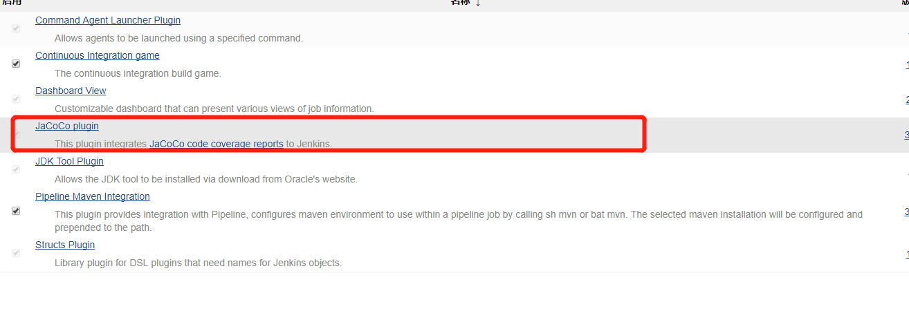
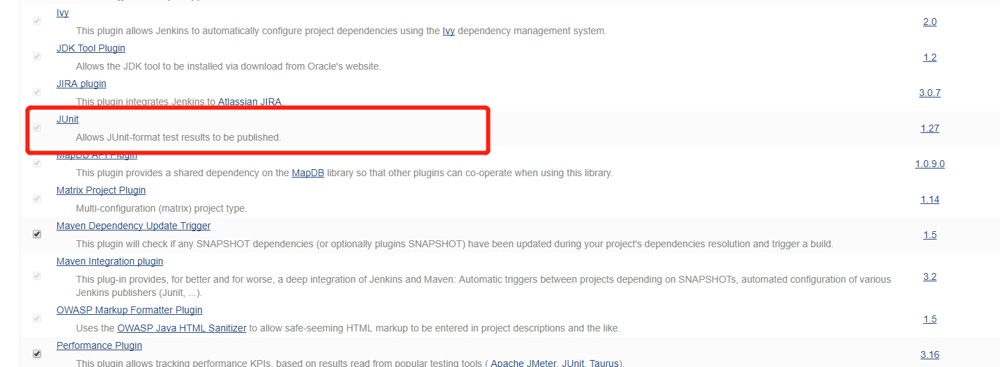
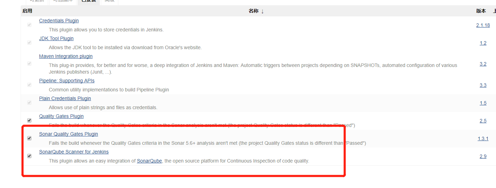

# 使用jenkins pipeline实现maven项目自动化构建打包部署至k8s


## 前言
目前公司环境分为dev,test,demo,pro等环境，各个环境独立，springcloud config配置复杂，构建部署强依赖运维，开发者平台应运而生。本文在于解决，开发者提交完开发的代码，在开发者平台点击构建，打包，部署等动作，目前这一套流程仅适用于dev环境，从test环境开始，都会产生chart包，部署会采用调用rancher接口的方式部署chart.

## 准备阶段
镜像准备：
1. jenkins镜像：jenkinsci/blueocean
2. gitlab已部署
3. 自定义的jenkins-slave镜像（后面介绍该镜像作用）
4. harbor私库
5. soanrqube安装部署

以上工具均已搭好，这里不做阐述

```
jenkins构建部署流程：jenkins-ui界面创建流水线job,配置好构建参数和jenkinsfile地址，pipeline流程大致分为：1,拉去代码;
2,并行run测试类,静态代码检查,生成sonar代码质量报告;3,maven编译构建;4，docker build和tag，并推送到harbor私库;5,部署
到dev环境
```

## jenkins系统设置，插件管理

### 1，Global Pipeline Libraries



Name：对应jenkinsfile的library的名字

Default version: master

Repository URL:指定share_jenkins的gitlab地址

credentials：配置一个gitlab的username和pwd

Branches to build: 指定share_jenkins的branch

### 2，云

名称：自定义，后面podTemplate需要使用

kubernetes地址和jenkins地址填上自己的真实地址
点击连接测试，如果连接成功配置成功


==注：jenkins需要安装kubernetes插件==

## 简单编写一个pipeline测试

pipeline script
```
def label = "mypod-${UUID.randomUUID().toString()}"
podTemplate(label: label, cloud: 'kubernetes') {
    node(label) {
        stage('拉去代码') {
            sh 'sleep 10s'
            echo 'hello world'
        }
    }
}
```
新建job,配置pipeline script,保存并构建,控制台输出：


## 脚本式完整流程pipeline细节部分代码展示





指定containerTemplate,挂载volumes,项目Dockerfile,使用kubectl命令部署服务

#### containerTemplate
image使用自定义的jenkins-slave镜像


1,基础镜像选择jnlp-slave:latest

2,使用root用户(挂载卷,写入内容，下载安装),或者配置jenkins用户权限，使用sudo命令

3,下载安装maven

4,替换conf下的settings.xml文件,settings中指定容器中本地repo,maven私服地址

5,添加kubectl配置文件

6,创建repo目录

7,下载libltd7.*(缺少这个,在pod中使用docker会报错)

#### volumes

挂载docker和docker.sock,容器内可以使用宿主机的docker命令，docker build/push

挂载.kube,kubeconfig文件,容器内可以使用宿主机的kubectl命令,并部署服务到集群

挂载pvc,确保job每次maven编译时不需要从头处理maven依赖(多个pod挂载一个pvc不行，需要排队)

#### java项目Dockerfile


BASE_IMAGE:基础镜像(翟宏伟处理,加入skywalking)

JAR_FILE：脚手架项目传入参数

$JAVA_OPTS：这个会在k8s的deployment文件中传入，加入skywalking的-javaagent

#### 使用kubectl命令部署服务

k8s-deployement.tpl文件放在java项目的根目录文件下


pipeline中使用这个短代码替换tpl文件中的模板值


使用kubectl命令需要指定kubeconfig文件


[link](./kubectl问题.md)

### 脚本式pipeline存在的问题

1,脚本式pipeline各stage执行任务时，一旦发生错误，后面的stage直接就中断了

2,这个脚本式pipeline采用的镜像过大，后面会在申明式pipeline中解决

3,docker运行依赖的组件必需要在镜像中下载安装好(libltd7*)

4,单元测试和静态代码检查这块并行处理问题

### pipeline高级用法声明式

代码展示

```
#! groopvy
import java.time.LocalDateTime
import java.time.format.DateTimeFormatter

/**
 * 默认tag
 * @return
 **/
@NonCPS
def getDefaultTag(){
    LocalDateTime localDateTime = LocalDateTime.now()
    localDateTime.format(DateTimeFormatter.ofPattern('yyyyMMddmmss',Locale.CHINESE))
}

/**
 * 流水线脚本
 * @return
 **/
def call(body){
    def config = [:]
    body.resolveStrategy = Closure.DELEGATE_FIRST
    body.delegate = config
    body()

    assert  config.name: 'name不能为空'

    def needHost = config.needHost ?:'false'
    def imageName = params.IMAGE_NAME ?:config.name
    def deployENV = params.DEPLOY_ENV ?:'dev'
    def type = config.type ?:'maven'
    def coverage = config.coverage?:'10'

    def imageTag = params.IMAGE_TAG ?:getDefaultTag()
    def baseImage = params.BASE_IMAGE ?:env.BASE_IMAGE
    def cmd = params.CMD ?:''
    assert  baseImage:'基础镜像不能为空'

    pipeline{
        agent{
            kubernetes{
                label 'mypod'
                cloud 'kubernetes'
                yaml '''
apiVersion: v1
kind: Pod
metadata:
  labels:
    some-label: some-label-value
  namespace:hello
  name: mypod
spec:
  containers:
    -name: maven
     image: 1179325921/maven:1.1.1
     command:
     - cat 
     tty: true
     volumeMounts:
       - mountPath: /var/run/docker.sock
         name: docker-sock
       - mountPath: /usr/share/maven/repo
         name: tools-jenkins-maven
       - mountPath: /var/jenkins_home
         name: jenkins-data
       - mountPath: /root/.kube
         name: kubel
   volumes:
     - name: tools-jenkins-maven
       persistentVolumeClaim:
         claimName: tools-jenkins-maven-pc
     - hostPath:
         path: /data/jenkins
         type: ""
       name: jenkins-data
     - hostPath:
         path: /var/run/docker.sock
         type: ""
       name: docker-sock
     - hostPath:
         path: /root/.kube
         type: ""
       name: kubel
'''
            }
        }
        stages{
            stage('拉取代码'){
                steps{
                    echo 'fetch code from git'
                    checkout scm
                }
            }
            stage('maven parallel stage'){
                parallel{
                    stage('单元测试'){
                        steps{
                            container('maven'){
                                echo 'starting unitTest...'
                                //注入jacoco插件配置
                                sh 'mvn -U -B org.jacoco-maven-plugin:prepare-agent clean verify -Dautoconfig.skip=ture -Dmaven.test.skip=false -Dmaven.test.failure.ingore=ture -f pom.xml'
                                junit allowEmptyResults:true,testResults:'**/targer/surefire-reports/*xml'
                                //单元测试覆盖率
                                jacoco changeBuildStatus:true,maximumLineCoverage:"${coverage}"
                                //测试报告
                                xuint([JUnit(deleteOutputFiles:true,failIfNotNew:true,pattern:'**/target/surefire-reports/*xml',skipNoTestFiles:false,stopProcessingIfError:true)])
                            }
                        }
                    }
                }
                stage('静态代码检查'){
                    steps{
                        coverage('maven'){
                            echo "starting soanr analyze..."
                            withSonarQubeEnv('sonarqube'){
                                sh 'mvn -f pom.xml clean compile sonar:sonar'
                            }
                        }
                    }
                    stage('maven构建'){
                        steps{
                            container('maven'){
                                sh 'mvn clean package -U -Dmaven.test.skip=true'
                            }
                        }
                    }
                }
            }
            stage('Quality Gate'){
                steps{
                    container('maven'){
                        scripts{
                            //获取soanrqube报告，设置超时1分钟
                            timeout(1){
                                //休息10秒，线程
                                sleep(10)
                                //利用sonar webhook功能通知pipeline代码检测结果，未通过质量阀，pipeline将会fail
                                def qg = waitForQualityGate()
                                if(qg.status != 'OK'){
                                    error("未通过SonarQube的代码质量阀检查，请及时修改！failure:${qg.status}")
                                }
                            }
                        }
                    }
                }
            }
            stage('docker build'){
                steps{
                    container('maven'){
                        sh label:'',script:'''#!/bin/bash
        echo -e 'FROM xxxx/libray/java-sw\nVOLUME /tmp\nARG JAR_FILE\nADD ${JAR_FILE} app.jar\nRUN touch /app.jar && ln -sf /usr/share/zoneinfo/Asia/Shanghai /etc/localtime\nENTRYPOINT exec java $JAVA_OPTS -Duser.timezone=Asia/Shanghai -Djava.security.egd=file:/dev/./urandom -Dagent.service_name=${JOB_NAME} -Dcolllector.backend_service=skywalking-oap -jar /app.jar' > /home/jenkins/workspace/${JOB_NAME}/Dockerfile
        '''
                        sh "mvn -DskipTests -Ddocker.tag=latest dockerfile:build"
                        script{
                            sh 'docker login xxxxxx -uxx -pxx'
                            def image = docker.image(imageName)
                            image.push()
                            image.tag(imageTag)
                            image.push(imageTag)
                        }
                    }
                }
            }
            stage('deploy dev'){
                steps{
                    script{
                        if(needIngress == 'true'){
                            sh "sed -e 's#{APP_HOST}#${}#g;s#{APP_NAME}#s{name}#g' k8s-ingress.tpl > k8s-ingress.yml"
                            sh "kubectl apply -f k8s-ingress.yml --namespace=dev --kubeconfig='/root/.kube.config'"
                        }
                    }
                    sh "sed -e 's#{IMAGE_URL}#${imageName}#g;s#{APP_NAME}#${name};s#{SPRING_PROFILE}#dev#g;s#{JOS}#-Xmx128m -javaagent:/usr/skywalking/agent/skwwalking-agent.jar#g;s#{SVC_TYPE}#ClusterIP#g' k8s-deployment.tpl > k8s-deployment.ynl"
                    sh "kubectl apply -f k8s-deployment.yml --namespace=dev --kubecong='/root/.kube/config'"
                }
            }
            //无论是否出现错误都会执行
            post{
                always{
                    echo '删除资源'
                    cleanWs()
                    // 恢复测试数据库到初始状态

                }
            }
        }
    }


}
```
##### 声明式pipeline语法特点普及
概念：
- 块(block{}):由大括号括起来的语句，例如pipeline{},script{},parameters{}等等
- 章节(Section{}):包含一个或多个指令或步骤，例如agent,post,stages,steps等等
- 指令(Directives):实际操作的模块，environment,stage,when等等
- 步骤(steps): 一项任务

注意事项： 
1. 声明式pipeline必须包含在pipeline{...}语法块内，且有且只能有一个pipeline块
2. agent必须在pipeline块内顶层定义，但stage可以选择内是否使用或是指定agent
3. stages 必须，包括顺序执行的一个或多个stage命令，在pipeline内仅能使用一次，通常位于agent/options后面
4. steps 必须，steps位于stage指令块内部，包括一个或多个step。仅有一个step的情况下可以忽略关键字step及其{}
5. environment 不是必须的，environment定义了一组全局的环境变量键值对，存在于pipeline{}或者stage指令内
6. post 不是必须的，用于pipeline的最外层或者stage{}中
7. when仅用于stage内部(用于做条件判断) 
```
when {branch 'master'}
when {environment name:'DEPLOY_TO',value:'dev'}
当有环境变量 name 为 DEPLOY_TO 值是dev 条件成立
when {expression {return params.DEBUG_BUILD}}
表达式返回值为真时
when {not {branch 'master'}}
when {allOf {branch 'master'; environment name:'DEBUG_TO',value:'production'}}
allOf 所有条件都满足时
when {anyOf {branch 'master' ; branch 'staging'}}
anyOf有一个条件满足时即可
```
##### 逐个分析：
###### 1. agent,使用kubernets,指定pod模板。
针对上一次镜像过大问题缩减镜像：

```
FROM maven:alpine
USER root
ADD settings.xml /usr/share/maven/conf
RUN mkdir /usr/share/maven/repo && mkdir /root/.kube
ADD docker /usr/bin
ADD kubectl /usr/bin
```
- 基础镜像不在使用jenkins，使用maven:alpine镜像，这个镜像精简，但是会缺少很多东西，尤其是如果在容器内要使用宿主机的docker命令，或缺少libltdl7*等工具，这是因为，宿主机docker是使用npm安装，有很多依赖。重新下载docker-client的tar包，安装解压出二进制。

-  默认root用户
- 用修改远程私库和本地仓库的settings.xml文件替换maven的该文件
-  创建本次maven仓库和kubeconfig目录，后面挂载卷使用(挂载tools-jenkins-pvc和kubectl的配置文件)
-  把docker的二进制文件添加到/usr/bin目录下，保证容器内可以使用docker命令
-  把kubectl的二进制文件添加到/usr/bin目录下

###### 2. volumes挂载：
由于只做镜像是把docker二进制文件打入新的镜像中，我们就无须挂载宿主机的docker,同时也解决了挂载宿主机docker，缺少依赖的问题。

###### 3. stage('maven parallel stage')
如果要使用并行stage去运行指令是，parallel{...}很好的解决这个问题。parallel{...}块内定义了两个并行的stage,分别是单元测试和maven构建






安装上图四个插件，其中sonarqube(已安装)需要配置一下，在系统设置里进行配置


name:名字会在pipeline中withSonarQubeEnv中使用
server url:soanrqube部署的地址
authentication token:需要在soanrqube创建一个token复制到这里

jacoco指令
jacoco 配置单元测试覆盖率要求，未达到要求pipeline将会fail


###### 4. Quality Gate

利用sonar webhook功能通知pipeline代码检测结果，如果未通过，pipeline就会failure，可以配合post{...}的failure使用

###### 5. post

post{...}代码块内的指令有always，changed，failure，success，unstable，和aborted。

always:无论Pipeline运行的完成状态如何都会执行

changed:只有当前Pipeline运行的状态与先前完成的Pipeline的状态不同时，才能触发

failure:只有当前Pipeline运行的状态失败，才能触发运行

success:只有当前Pipeline运行的状态成功，才能触发运行

aborted:取消时触发

unstable:不稳定

#### 目前依然存在的几个问题

1,102节点镜像问题会导致出现sandbox问题，目前已隔离(这个102节点有个定时任务会杀掉谷歌镜像导致)

2,jenkins调度pod执行任务时，pod必须是在节点103上(跟jenkins在同一节点)才会执行任务,101节点不会执行任务也不会报错,等几分钟会杀掉101的pod重新调度到103节点(必须要在103是因为Jenkins-master错误绑定的pvc,所以导致该pvc一直被占用着,102和101挂载不了。ceph rbd存储,只有ReadWriteOnce和ReadOnlyMany，不支持ReadWriteMany)

3,maven项目本地repo采用的pvc,多个pod无法同时挂载，这样就会造成job需要排队挨个构建

4,由于com.spotify的maven-dockerfile-plugin插件问题，导致上面在制作镜像时无法把maven和docker分开(原本是打算把maven做一个镜像，docker和kubectl放到另一个镜像里)

5,可能是由于选择的jenkins镜像问题,无法写入authentication token,实际并不影响使用

6,解决docker login明文问题：选择把宿主机的.docker文件夹下的config文件打到镜像中。这样就不需要login直接就可推私库