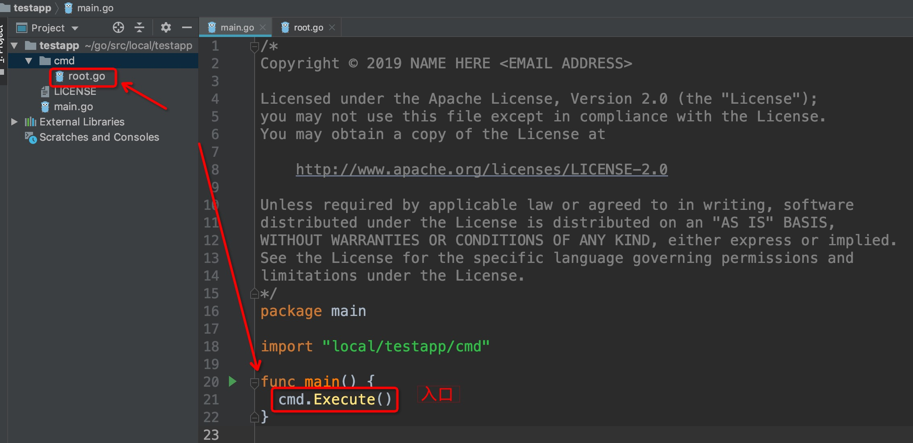
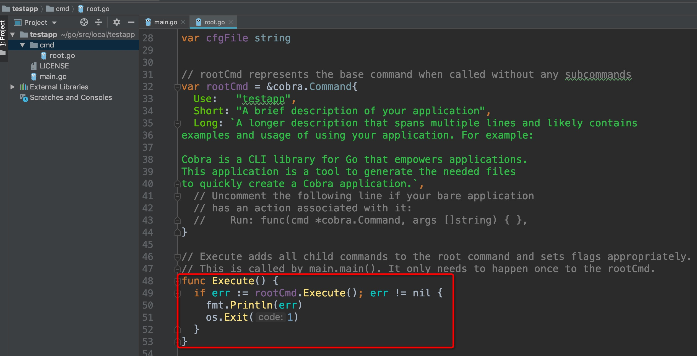
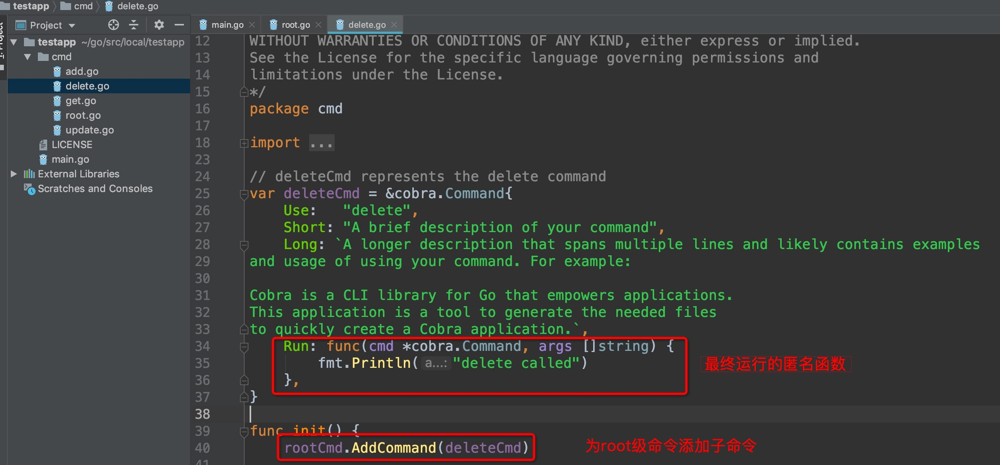
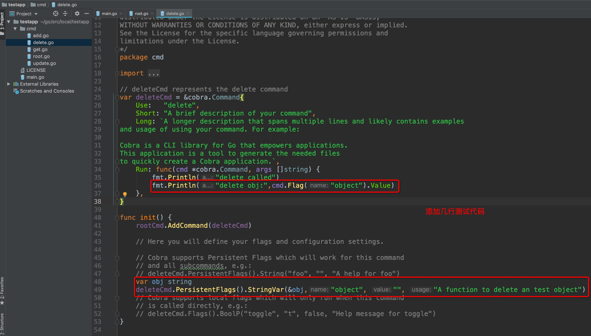
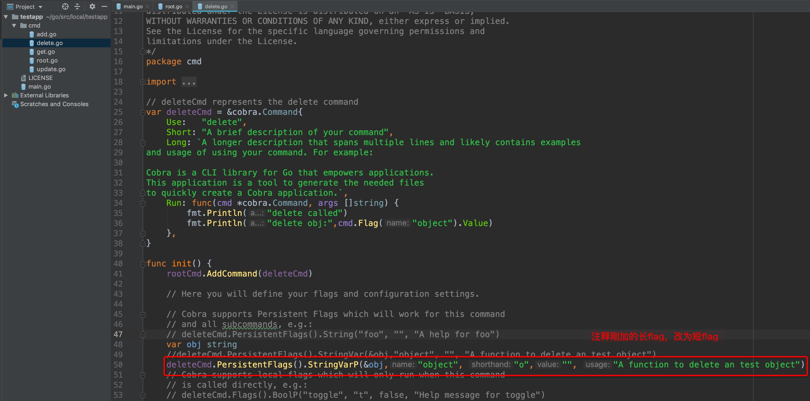
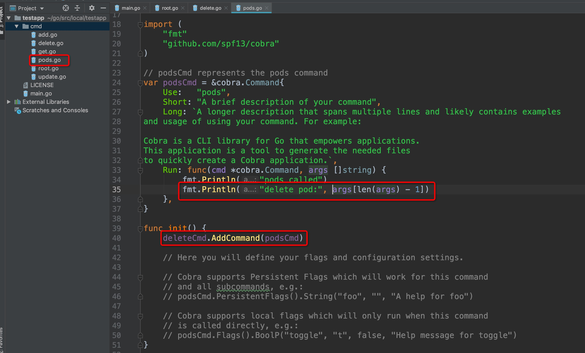

## cobra
#### 什么是cobra?
github主页: https://github.com/spf13/cobra
主页的介绍是: Cobra是一个强大的用于创建现代化CLI命令行程序的库，用于生成应用程序和命令文件。众多高知名度的项目采用了它，例如我们熟悉的kubernetes和docker
cobra创建的程序CLI遵循的模式是: `APPNAME COMMAND ARG --FLAG`，与常见的其他命令行程序一样，例如git: `git clone URL --bare`

#### 安装：

```
#最简单的安装方式，但毫无意外，事情并没有那么简单，我们的网络的问题，导致无法正常安装依赖，
go get -u github.com/spf13/cobra/cobra

#怎么办呢？先进入GOPATH中，手动安装报错缺失的两个依赖:
cd /home/villager/go/
mkdir -p src/golang.org/x
cd golang.org/x
git clone https://github.com/golang/text.git
git clone https://github.com/golang/sys.git

#然后执行:
go install github.com/spf13/cobra/cobra
#安装完毕,记得把GOBIN加入PATH环境变量哦,否则无法直接运行cobra命令
```

#### 简单试用cobra:
```
matebook-x-pro:local ywq$ cd /Users/ywq/go/src/local/
matebook-x-pro:local ywq$ cobra init testapp --pkg-name=local/testapp
matebook-x-pro:local ywq$ ls
testapp
matebook-x-pro:local ywq$ ls testapp/
LICENSE  cmd/     main.go
matebook-x-pro:local ywq$ ls testapp/cmd/
root.go
matebook-x-pro:local ywq$ cd testapp
matebook-x-pro:local ywq$ go run main.go 
# 报错：subcommand is required，要求提供子命令
# 因需要多次测试，这里所有的测试步骤就把build的步骤跳过，直接使用go run main.go进行测试
```
**我们打开IDE来查看一下testapp的代码结构:**



```
# 现在还未创建子命令，那么来创建几个试试:
matebook-x-pro:testapp ywq$ cobra add get
get created at /Users/ywq/go/src/local/testapp
matebook-x-pro:testapp ywq$ cobra add delete
delete created at /Users/ywq/go/src/local/testapp
matebook-x-pro:testapp ywq$ cobra add add
add created at /Users/ywq/go/src/local/testapp
matebook-x-pro:testapp ywq$ cobra add update
matebook-x-pro:testapp ywq$ ls cmd/
add.go		delete.go	get.go		root.go		update.go

# 查看help，可以发现刚添加的子命令已经加入提示并可用了
matebook-x-pro:testapp ywq$ go run main.go -h
...

Available Commands:
  add         A brief description of your command
  delete      A brief description of your command
  get         A brief description of your command
  help        Help about any command
  update      A brief description of your command

# 调用子命令试试:
matebook-x-pro:testapp ywq$ go run main.go get
get called
matebook-x-pro:testapp ywq$ go run main.go add
add called
```

**来看看新增的子命令是怎么运行的呢？**

截图圈中部分可以看出，子命令是在init()函数里为root级添加了一个子命令，先不去管底层实现，接着往下.

**测试cobra的强大简洁的flag处理**
我们在`cmd/delete.go`的init()函数中，定义一个flag处理配置:
```
var obj string
deleteCmd.PersistentFlags().StringVar(&obj,"object", "", "A function to delete an test object")
```
在`Run:func()`匿名函数中添加一行输出:
`fmt.Println("delete obj:",cmd.Flag("object").Value)`


运行结果:

```
matebook-x-pro:testapp ywq$ go run main.go delete --object obj1
delete called
delete obj: obj1

```
如果觉得`--`flag符号太麻烦，cobra同样支持短符号`-`flag缩写:


运行结果:

```
matebook-x-pro:testapp ywq$ go run main.go delete -o obj1
delete called
delete obj: obj1

```

这里只是两级命令加flag,但我们常见的，例如(kubectl delete pod xxx)，是有3级命令 + args的，怎么再多添加一级子命令呢？cobra帮你一条命令实现

```
matebook-x-pro:testapp ywq$ cobra add pods -p deleteCmd  # -p为父级命令，默认其名称格式为(parentCommandName)Cmd
matebook-x-pro:testapp ywq$ ls cmd
add.go          delete.go       get.go          pods.go         root.go         update.go

```
可以发现,cmd/目录下多了一个pods.go文件，我们来看看它是怎么关联上delete父级命令的,同时为它添加一行输出:

执行命令:

```
matebook-x-pro:testapp ywq$ go run main.go delete pods pod1
pods called
delete pods: pod1

```

** 看到这里，相信对cobra的强大简洁已经有了初步的认知，建议自行进入项目主页了解详情并进行安装测试**