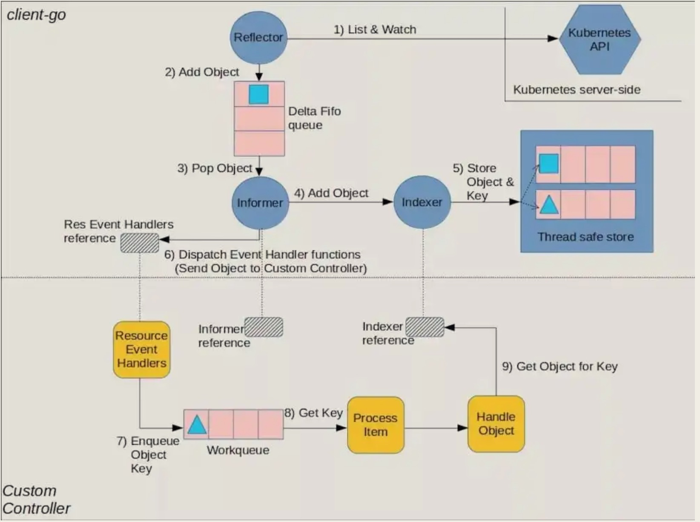

## 前言

Controller作为k8s的资源控制组件，必定要实时地监控对比资源的目标状态和当前状态，这其中会与apiserver产生大量的交互。在k8s中，k8s各个组件都会与apiServer交互，因此k8s在项目中封装了一个client-go公用模块，路径位于项目`vendor/k8s.io/client-go`，非常多的组件向ApiServer的curd操作都在client-go包中封装，client-go是k8s项目的核心包之一。它与controller的工作流程密不可分，在读controller源码理解其工作流程前，必须首先对informer有一定得了解，因此本篇专门对informer机制进行简单地介绍说明，为后面的文章铺垫。

## ApiServer的连接方式

**1.短连接**

获取kubernetes某种资源的方式有多种，常见的如kubectl、调用apiserver restful api的接口，restful api接口详情查看官方手册。同时也可通过kubectl命令来查看操作对应的api，例如：

```
kubectl get pod POD_NAME -v=9
```

输出信息中会包含此操作对应的api url

但这种全量型的操作方式，在大集群规模下，开销还是比较大的，因此，k8s还提供长连接的watch接口。

**2.长连接**

watch接口是对list接口的一种改进，在调用watch接口后，首先会一次性返回list的数据，同时会保持会话连接，后续的接口对象的curd，都会产生事件由apiserver将变更数据推送给调用端，调用端接收数据后，再更新初始接收到的list的全量数据以及其他操作。

**3.client-go**

watch依然比较麻烦，毕竟list获取的数据以及后续watch到的数据，需要调用端在内部处理和更新缓存。索性，官方提供了一个client-go客户端工具包封装，里面提供多种apiserver相关操作，做到开箱即用，k8s各组件也都使用了它。

## client-go工作模式

在client-go中，informer是对watch操作的一次再封装， Informer是一个带有本地缓存、索引功能的client端(list/watch)，在绝大多数场景下，客户端与apiserver的交互都是读多写少的，因此，做好本地缓存(Store)和索引(Index)可以大幅减少开销提升性能。同时，informer可以注册相应的EventHandler事件触发器的，在执行资源更新后触发其他连锁操作。

#### 工作流程图



#### 流程图组件解释

图中有上下分层，上层逻辑由client-go内部封装，下层的逻辑由controller内部完成，对照上图分层说明：

**上层**：

- Reflector：反射器，调用 Kubernetes 的 List/Watch API，实现对 apiserver 指定类型对象的监控(List/Watch)，将获取的数据，反序列化成对象实例，存入delta 缓存队列中；

  

- DeltaIFIFO Queue：一个增量fifo缓存队列，接收来自 Reflector 传递的反序列化对象；

  

- Informer：是这个流程中的关键重要的桥梁，主要有两个工作：1.从DeltaIFIFO Queue中获取对象，更新LocalStore的cache数据 2.触发后续的eventHandler，生成工作队列对象，加入WorkQueue，供后面的controller读取进行实际的控制处理工作。（值得注意的是，每一种资源都对应一个informer，多种资源对应多个informer，但每个informer都会与apiserver建立起一个watch长连接，通常controller都会使用SharedInformerFactory这个单例工厂模式，来使所有的informer的创建全部都经过这个单例工厂，从而保证每种资源对应的informer都是唯一且可复用的，以降低开销。）

  

- LocalStore：informer 的 cache缓存，这里缓存的是从 apiserver 中获取得到的对象(其中有一部分可能还在DeltaFIFO 中没来得及放入缓存里来)，此时client再查询对象的时候就直接从 cache 中查找，减少了 apiserver 的压力，LocalStore 只会被 Lister 的 List/Get 读操作的方法访问；

**下层**：

- ResourceEventHandler：由controller注册，由informer来触发，当resource object符合过滤规则时，触发ResourceEventHandler将其丢入WorkQueue内。

  

- WorkQueue：informer更新本地的缓存后，会根据注册的相关EventHandler，生成事件放入WorkQueue内，Controller 接收 WorkQueue  中的事件，然后相应执行controller的业务逻辑，一般来说，就是保证资源对象的目标状态与实际状态达成一致的逻辑。

如果你想自定义controller，关于infomer的实践建议，参考这里：

[如何用 client-go 拓展 Kubernetes 的 API](https://mp.weixin.qq.com/s?__biz=MzU1OTAzNzc5MQ==&mid=2247484052&idx=1&sn=cec9f4a1ee0d21c5b2c51bd147b8af59&chksm=fc1c2ea4cb6ba7b283eef5ac4a45985437c648361831bc3e6dd5f38053be1968b3389386e415&scene=21#wechat_redirect)


## APIVersion的说明

在每一个资源的申明yaml文件中，有一个必须存在的一个键`apiVersion`，这代表了apiserver对相应资源的rest操作，所绑定的group和version，常见的值例如："apps/v1",斜杠前一位代表的是api的group，斜杠后的值则代表的是version。每一种资源的rest操作，都必须绑定正确的group和version。

在informer的代码中，因为与apiserver直接交互，因此api的group和version相关的结构体会反复出现，且结构体命名非常容易混淆。因此，这里列出进行说明，对阅读informer的源码有一定额外的帮助。

- **APIGroup** : api所属组别的信息，其中包含的groupVersion字段，即我们每个yaml文件中apiVersion所指定的
- **APIResource**：所有使用到的resouce资源类型，包含pod/deployment/svc等等

**APIGroup结构体**：

```go
type APIGroup struct {
	TypeMeta `json:",inline"`
	Name string `json:"name" protobuf:"bytes,1,opt,name=name"`
	Versions []GroupVersionForDiscovery `json:"versions" protobuf:"bytes,2,rep,name=versions"`
	PreferredVersion GroupVersionForDiscovery `json:"preferredVersion,omitempty" protobuf:"bytes,3,opt,name=preferredVersion"`
	ServerAddressByClientCIDRs []ServerAddressByClientCIDR `json:"serverAddressByClientCIDRs,omitempty" protobuf:"bytes,4,rep,name=serverAddressByClientCIDRs"`
}
```

**APIGroup实例**：

通过如下方式快速访问的apiserver的rest api：

```shell
# 节点上运行kubectl proxy代理,免去认证步骤，这不太安全，只建议测试使用，使用完毕后及时关闭 
~# kubectl proxy --port=8001 & 

# 查看所有的APIGroup，groups 数组内的每一个成员都是一个APIGroup实例
~#curl 127.0.0.1:8001/apis/
{
  "kind": "APIGroupList",
  "apiVersion": "v1",
  "groups": [
    {
      "name": "apiregistration.k8s.io",
      "versions": [
        {
          "groupVersion": "apiregistration.k8s.io/v1",
          "version": "v1"
        },
        {
          "groupVersion": "apiregistration.k8s.io/v1beta1",
          "version": "v1beta1"
        }
      ],
      "preferredVersion": {
        "groupVersion": "apiregistration.k8s.io/v1",
        "version": "v1"
      }
    },
    {
      "name": "extensions",
      "versions": [
        {
          "groupVersion": "extensions/v1beta1",
          "version": "v1beta1"
        }
      ],
      "preferredVersion": {
        "groupVersion": "extensions/v1beta1",
        "version": "v1beta1"
      }
    },
    ...
}
```

**APIResource结构体**

```go
type APIResourceList struct {
	TypeMeta `json:",inline"`
	GroupVersion string `json:"groupVersion" protobuf:"bytes,1,opt,name=groupVersion"`
	APIResources []APIResource `json:"resources" protobuf:"bytes,2,rep,name=resources"`
}
```

**APIResource实例**

Resource分为多个groupVersion

```shell
~# curl 127.0.0.1:8001/api/v1 #默认资源
~# curl 127.0.0.1:8001/apis/apps/v1/  # 扩展资源
```

具体参考官方api说明：

https://kubernetes.io/docs/reference/generated/kubernetes-api/v1.14/

下面是一个APIResourceList实例：

```shell
~# curl 127.0.0.1:8001/api/v1
{
  "kind": "APIResourceList",
  "groupVersion": "v1",
  "resources": [
    {
      "name": "pods",
      "singularName": "",
      "namespaced": true,
      "kind": "Pod",
      "verbs": [
        "create",
        "delete",
        "deletecollection",
        "get",
        "list",
        "patch",
        "update",
        "watch"
      ],
      "shortNames": [
        "po"
      ],
      "categories": [
        "all"
      ]
    },
    {
      "name": "configmaps",
      "singularName": "",
      "namespaced": true,
      "kind": "ConfigMap",
      "verbs": [
        "create",
        "delete",
        "deletecollection",
        "get",
        "list",
        "patch",
        "update",
        "watch"
      ],
      "shortNames": [
        "cm"
      ]
    },
    {
      "name": "endpoints",
      "singularName": "",
      "namespaced": true,
      "kind": "Endpoints",
      "verbs": [
        "create",
        "delete",
        "deletecollection",
        "get",
        "list",
        "patch",
        "update",
        "watch"
      ],
      "shortNames": [
        "ep"
      ]
    },
    ...
  ]
}
```


## 总结

本篇先简单介绍一下informer和apiGroup的相关信息，以及和controller组件结合的工作流程，为后面的几篇(deploymentCrontroller、replicaSet controller 、statefulSetController等)分析作铺垫，后面的文章中会反复提到本篇上方的informer与controller结合工作的流程描述和图解。

