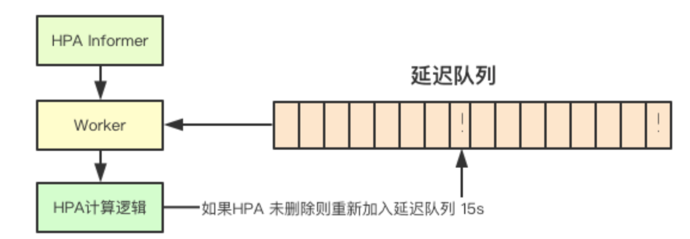
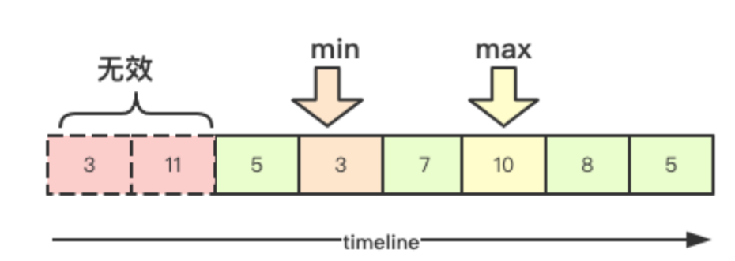
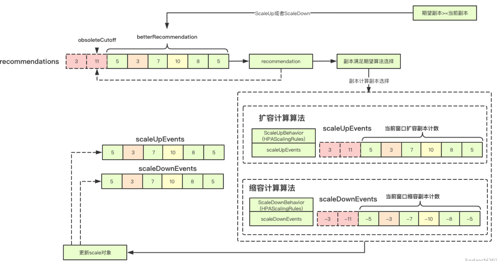
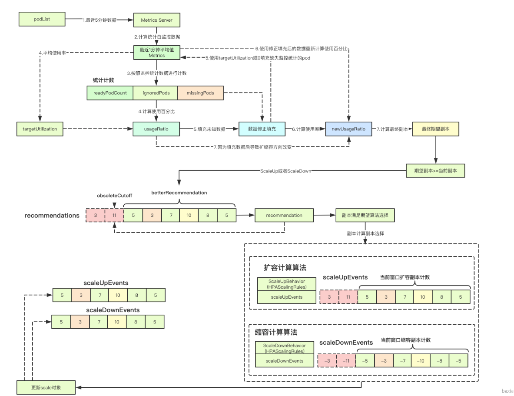

# HPA横向伸缩

HPA是k8s中横向伸缩的实现，里面有很多可以借鉴的思想，比如延迟队列、时间序列窗口、变更事件机制、稳定性考量等关键机制， 让我们一起来学习下大佬们的关键实现<br />

# 1. 基础概念
HorizontalPodAutoscaler(后面简称HPA)作为通用横向扩容的实现，有很多关键的机制，这里我们先来看下这些关键的的机制的目标<br />

## 1.1 横向扩容实现机制

## 1.2 HPA的四个区间
根据HPA的参数和当前Scale(目标资源)的当前副本计数，可以将HPA分为如下四种个区间：关闭、高水位、低水位、正常，只有处于正常区间内，HPA控制器才会进行动态的调整<br />

## 1.3 度量指标类型
HPA目前支持的度量类型主要包含两种Pod和Resource，剩下的虽然在官方的描述中有说明，但是代码上目前并没有实现，监控的数据主要是通过apiserver代理metrics server实现，访问接口如下
```go
/api/v1/model/namespaces/{namespace}/pod-list/{podName1,podName2}/metrics/{metricName}
```


## 1.4 延迟队列

<br />HPA控制器并不监控底层的各种informer比如Pod、Deployment、ReplicaSet等资源的变更，而是每次处理完成后都将当前HPA对象重新放入延迟队列中，从而触发下一次的检测，如果你没有修改默认这个时间是15s, 也就是说再进行一次一致性检测之后，即时度量指标超量也至少需要15s的时间才会被HPA感知到<br />

## 1.5 监控时间序列窗口

<br />在从metrics server获取pod监控数据的时候，HPA控制器会获取最近5分钟的数据(硬编码)并从中获取最近1分钟(硬编码)的数据来进行计算，相当于取最近一分钟的数据作为样本来进行计算，注意这里的1分钟是指的监控数据中最新的那边指标的前一分钟内的数据，而不是当时间<br />

## 1.6 稳定性与延迟

<br />前面提过延迟队列会每15s都会触发一次HPA的检测，那如果1分钟内的监控数据有所变动，则就会产生很多scale更新操作，从而导致对应的控制器的副本时数量的频繁的变更， 为了保证对应资源的稳定性， HPA控制器在实现上加入了一个延迟时间，即在该时间窗口内会保留之前的决策建议，然后根据当前所有有效的决策建议来进行决策，从而保证期望的副本数量尽量小的变更，保证稳定性<br />

# 2.核心实现
HPA控制器的实现，主要分为如下部分：获取scale对象、根据区间进行快速决策, 然后就是核心实现根据伸缩算法根据当前的metric、当前副本、伸缩策略来进行最终期望副本的计算，让我们依次来看下关键实现
## 2.1 根据ScaleTargetRef来获取scale对象
主要是根据神器scheme来获取对应的版本，然后在通过版本获取对应的Resource的scale对象

代码路径`pkg/controller/podautoscaler/horizontal.go`
```go
	targetGV, err := schema.ParseGroupVersion(hpa.Spec.ScaleTargetRef.APIVersion)    
	targetGK := schema.GroupKind{
        Group: targetGV.Group,
        Kind:  hpa.Spec.ScaleTargetRef.Kind,
    }
	scale, targetGR, err := a.scaleForResourceMappings(hpa.Namespace, hpa.Spec.ScaleTargetRef.Name, mappings)
```
## 2.2 区间决策

<br />区间决策会首先根据当前的scale对象和当前hpa里面配置的对应的参数的值，决策当前的副本数量，其中针对于超过设定的maxReplicas和小于minReplicas两种情况，只需要简单的修正为对应的值，直接更新对应的scale对象即可，而scale副本为0的对象，则hpa不会在进行任何操作
```go
	if scale.Spec.Replicas == 0 && minReplicas != 0 {
        // 已经关闭autoscaling
        desiredReplicas = 0
        rescale = false
        setCondition(hpa, autoscalingv2.ScalingActive, v1.ConditionFalse, "ScalingDisabled", "scaling is disabled since the replica count of the target is zero")
    } else if currentReplicas > hpa.Spec.MaxReplicas {
        // 如果当前副本数大于期望副本
        desiredReplicas = hpa.Spec.MaxReplicas
    } else if currentReplicas < minReplicas {
        // 如果当前副本数小于最小副本
        desiredReplicas = minReplicas
    } else {
		// 该部分逻辑比较复杂，后面单独说，其实也就是HPA最关键的实现部分之一
    }
```
## 2.3 HPA动态伸缩决策核心逻辑

<br />核心决策逻辑主要分为两个大的步骤：1）通过监控数据决策当前的目标期望副本数量 2）根据behavior来进行最终期望副本数量的修正， 然后我们继续深入底层
```go
        // 通过监控数据获取获取期望的副本数量、时间、状态
        metricDesiredReplicas, metricName, metricStatuses, metricTimestamp, err = a.computeReplicasForMetrics(hpa, scale, hpa.Spec.Metrics)
		
		// 如果通过监控决策的副本数量不为0，则就设置期望副本为监控决策的副本数
        if metricDesiredReplicas > desiredReplicas {
            desiredReplicas = metricDesiredReplicas
            rescaleMetric = metricName
        }
		// 根据behavior是否设置来进行最终的期望副本决策，其中也会考虑之前稳定性的相关数据
        if hpa.Spec.Behavior == nil {
            desiredReplicas = a.normalizeDesiredReplicas(hpa, key, currentReplicas, desiredReplicas, minReplicas)
        } else {
            desiredReplicas = a.normalizeDesiredReplicasWithBehaviors(hpa, key, currentReplicas, desiredReplicas, minReplicas)
        }
        // 如果发现当前副本数量不等于期望副本数
        rescale = desiredReplicas != currentReplicas
```
## 2.4 多维度量指标的副本计数决策
在HPA中可用设定多个监控度量指标,HPA在实现上会根据监控数据，从多个度量指标中获取提议最大的副本计数作为最终目标，为什么要采用最大的呢？因为要尽量满足所有的监控度量指标的扩容要求，所以就需要选择最大的期望副本计数
```go
func (a *HorizontalController) computeReplicasForMetrics(hpa *autoscalingv2.HorizontalPodAutoscaler, scale *autoscalingv1.Scale,
    // 根据设置的metricsl来进行提议副本数量的计算
    for i, metricSpec := range metricSpecs {
        // 获取提议的副本、数目、时间
        replicaCountProposal, metricNameProposal, timestampProposal, condition, err := a.computeReplicasForMetric(hpa, metricSpec, specReplicas, statusReplicas, selector, &statuses[i])

        if err != nil {
            if invalidMetricsCount <= 0 {
                invalidMetricCondition = condition
                invalidMetricError = err
            }
            // 无效的副本计数 
            invalidMetricsCount++
        }
        if err == nil && (replicas == 0 || replicaCountProposal > replicas) {
            // 每次都取较大的副本提议
            timestamp = timestampProposal
            replicas = replicaCountProposal
            metric = metricNameProposal
        }
    }
}
```
## 2.5 Pod度量指标的计算与期望副本决策实现

<br />这里只讲述Pod度量指标的计算实现机制，因为内容比较多，这里会分为几个小节
### 2.5.1 计算Pod度量指标数据
这里就是前面说的最近监控指标的获取部分， 在获取到监控指标数据之后，会取对应Pod最后一分钟的监控数据的平均值作为样本参与后面的期望副本计算
```go
func (h *HeapsterMetricsClient) GetRawMetric(metricName string, namespace string, selector labels.Selector, metricSelector labels.Selector) (PodMetricsInfo, time.Time, error) {
    // 获取所有的pod
    podList, err := h.podsGetter.Pods(namespace).List(metav1.ListOptions{LabelSelector: selector.String()})

    // 最近5分钟的状态
    startTime := now.Add(heapsterQueryStart)
    metricPath := fmt.Sprintf("/api/v1/model/namespaces/%s/pod-list/%s/metrics/%s",
        namespace,
        strings.Join(podNames, ","),
        metricName)
    resultRaw, err := h.services.
        ProxyGet(h.heapsterScheme, h.heapsterService, h.heapsterPort, metricPath, map[string]string{"start": startTime.Format(time.RFC3339)}).
        DoRaw()
    var timestamp *time.Time
    res := make(PodMetricsInfo, len(metrics.Items))
    // 遍历所有Pod的监控数据，然后进行最后一分钟的取样
    for i, podMetrics := range metrics.Items {
        // 其pod在最近1分钟内的平均值 
        val, podTimestamp, hadMetrics := collapseTimeSamples(podMetrics, time.Minute)
        if hadMetrics {
            res[podNames[i]] = PodMetric{
                Timestamp: podTimestamp,
                Window:    heapsterDefaultMetricWindow, // 1分钟 
                Value:     int64(val),
            }

            if timestamp == nil || podTimestamp.Before(*timestamp) {
                timestamp = &podTimestamp
            }
        }
    }

}
```
### 2.5.2 期望副本计算实现
期望副本的计算实现主要是在calcPlainMetricReplicas中，这里需要考虑的东西比较多，根据我的理解，我将这部分拆成一段段，方便读者理解，这些代码都属于calcPlainMetricReplicas<br />

> 1.在获取监控数据的时候，对应的Pod可能会有三种情况：

```go
readyPodCount, ignoredPods, missingPods := groupPods(podList, metrics, resource, c.cpuInitializationPeriod, c.delayOfInitialReadinessStatus)
```
1）当前Pod还在Pending状态，该类Pod在监控中被记录为ignore即跳过的(因为你也不知道他到底会不会成功，但至少目前是不成功的) 记为ignoredPods<br />2）正常状态，即有监控数据，就证明是正常的，至少还能获取到你的监控数据, 被极为记为readyPod<br />3）除去上面两种状态并且还没被删除的Pod都被记为missingPods<br />

> 2.计算使用率

```go
usageRatio, utilization := metricsclient.GetMetricUtilizationRatio(metrics, targetUtilization)
```
计算使用率其实就相对简单，我们就只计算readyPods的所有Pod的使用率即可<br />

> 3.重平衡ignored

```go
rebalanceIgnored := len(ignoredPods) > 0 && usageRatio > 1.0
// 中间省略部分逻辑 
    if rebalanceIgnored {
        // on a scale-up, treat unready pods as using 0% of the resource request
        // 如果需要重平衡跳过的pod. 放大后，将未就绪的pod视为使用0%的资源请求
        for podName := range ignoredPods {
            metrics[podName] = metricsclient.PodMetric{Value: 0}
        }
    }
```
如果使用率大于1.0则表明当前已经ready的Pod实际上已经达到了HPA触发阈值，但是当前正在pending的这部分Pod该如何计算呢？在k8s里面常说的一个句话就是最终期望状态，那对于这些当前正在pending状态的Pod其实最终大概率会变成ready。因为使用率现在已经超量，那我加上去这部分未来可能会成功的Pod，是不是就能满足阈值要求呢？所以这里就将对应的Value射为0，后面会重新计算，加入这部分Pod后是否能满足HPA的阈值设定<br />

> 4.missingPods

```go
    if len(missingPods) > 0 {
        // 如果错误的pod大于0，即有部分pod没有获到metric数据
        if usageRatio < 1.0 {
           
            // 如果是小于1.0, 即表示未达到使用率，则将对应的值设置为target目标使用量
            for podName := range missingPods {
                metrics[podName] = metricsclient.PodMetric{Value: targetUtilization}
            }
        } else {
            
            // 如果>1则表明， 要进行扩容， 则此时就那些未获得状态的pod值设置为0
            for podName := range missingPods {
                metrics[podName] = metricsclient.PodMetric{Value: 0}
            }
        }
    }
```
missingPods是当前既不在Ready也不在Pending状态的Pods, 这些Pod可能是失联也可能是失败，但是我们无法预知其状态，这就有两种选择，要么给个最大值、要么给个最小值，那么如何决策呢？答案是看当的使用率，如果使用率低于1.0即未到阈值，则我们尝试给这部分未知的 Pod的最大值，尝试如果这部分Pod不能恢复，我们当前会不会达到阈值，反之则会授予最小值，假装他们不存在<br />

> 5.决策结果

```go
if math.Abs(1.0-newUsageRatio) <= c.tolerance || (usageRatio < 1.0 && newUsageRatio > 1.0) || (usageRatio > 1.0 && newUsageRatio < 1.0) {
        // 如果更改太小，或者新的使用率会导致缩放方向的更改，则返回当前副本
        return currentReplicas, utilization, nil
    }
```
在经过上述的修正数据后，会重新进行使用率计算即newUsageRatio，如果发现计算后的值在容忍范围之内，当前是0.1，则就会进行任何的伸缩操作<br />
<br />反之在重新计算使用率之后，如果我们原本使用率<1.0即未达到阈值，进行数据填充后，现在却超过1.0，则不应该进行任何操作，为啥呢？因为原本ready的所有节点使用率<1.0，但你现在计算超出了1.0，则就应该缩放，你要是吧ready的缩放了，并且之前那些未知的节点依旧宕机，则就要重新进行扩容，这是不是在做无用功呢？<br />

## 2.6 带Behavior的稳定性决策

<br />不带behaviors的决策相对简单一些，这里我们主要聊下带behavior的决策实现，内容比较多也会分为几个小节, 所有实现主要是在stabilizeRecommendationWithBehaviors中
<a name="eZQlo"></a>
### 2.6.1 稳定时间窗口
HPA控制器中针对扩容和缩容分别有一个时间窗口，即在该窗口内会尽量保证HPA扩缩容的最终目标处于一个稳定的状态，其中扩容是3分钟，而缩容是5分钟
<a name="Cy8vh"></a>
### 2.6.2 根据期望副本是否满足更新延迟时间
```go
	if args.DesiredReplicas >= args.CurrentReplicas {
		// 如果期望的副本数大于等于当前的副本数,则延迟时间=scaleUpBehaviro的稳定窗口时间
		scaleDelaySeconds = *args.ScaleUpBehavior.StabilizationWindowSeconds
		betterRecommendation = min
	} else {
		// 期望副本数<当前的副本数
		scaleDelaySeconds = *args.ScaleDownBehavior.StabilizationWindowSeconds
		betterRecommendation = max
	}
```
在伸缩策略中， 针对扩容会按照窗口内的最小值来进行扩容，而针对缩容则按照窗口内的最大值来进行
### 2.6.3 计算最终建议副本数
首先根据延迟时间在当前窗口内，按照建议的比较函数去获得建议的目标副本数，
```go
	// 过时截止时间
	obsoleteCutoff := time.Now().Add(-time.Second * time.Duration(maxDelaySeconds))

	// 截止时间
	cutoff := time.Now().Add(-time.Second * time.Duration(scaleDelaySeconds))
	for i, rec := range a.recommendations[args.Key] {
		if rec.timestamp.After(cutoff) {
			// 在截止时间之后，则当前建议有效, 则根据之前的比较函数来决策最终的建议副本数
			recommendation = betterRecommendation(rec.recommendation, recommendation)
		}
	}
```
### 2.6.4 根据behavior进行期望副本决策
在之前进行决策我那次后，会决策出期望的最大值，此处就只需要根据behavior(其实就是我们伸缩容的策略)来进行最终期望副本的决策， 其中calculateScaleUpLimitWithScalingRules和calculateScaleDownLimitWithBehaviors其实只是根据我们扩容的策略，来进行对应pod数量的递增或者缩减操作，其中关键的设计是下面周期事件的关联计算
```go
func (a *HorizontalController) convertDesiredReplicasWithBehaviorRate(args NormalizationArg) (int32, string, string) {
	var possibleLimitingReason, possibleLimitingMessage string

	if args.DesiredReplicas > args.CurrentReplicas {
		// 如果期望副本大于当前副本，则就进行扩容
		scaleUpLimit := calculateScaleUpLimitWithScalingRules(args.CurrentReplicas, a.scaleUpEvents[args.Key], args.ScaleUpBehavior)
		if scaleUpLimit < args.CurrentReplicas {
			// 如果当前副本的数量大于限制的数量，则就不应该继续扩容，当前已经满足率了扩容需求
			scaleUpLimit = args.CurrentReplicas
		}
		// 最大允许的数量
		maximumAllowedReplicas := args.MaxReplicas
		if maximumAllowedReplicas > scaleUpLimit {
			// 如果最大数量大于扩容上线
			maximumAllowedReplicas = scaleUpLimit
		} else {
		}
		if args.DesiredReplicas > maximumAllowedReplicas {
			// 如果期望副本数量>最大允许副本数量
			return maximumAllowedReplicas, possibleLimitingReason, possibleLimitingMessage
		}
	} else if args.DesiredReplicas < args.CurrentReplicas {
		// 如果期望副本小于当前副本，则就进行缩容
		scaleDownLimit := calculateScaleDownLimitWithBehaviors(args.CurrentReplicas, a.scaleDownEvents[args.Key], args.ScaleDownBehavior)
		if scaleDownLimit > args.CurrentReplicas {
			scaleDownLimit = args.CurrentReplicas
		}
		minimumAllowedReplicas := args.MinReplicas
		if minimumAllowedReplicas < scaleDownLimit {
			minimumAllowedReplicas = scaleDownLimit
		} else {
		}
		if args.DesiredReplicas < minimumAllowedReplicas {
			return minimumAllowedReplicas, possibleLimitingReason, possibleLimitingMessage
		}
	}
	return args.DesiredReplicas, "DesiredWithinRange", "the desired count is within the acceptable range"
}

```
### 2.6.5周期事件
周期事件是指的在稳定时间窗口内，对应资源的所有变更事件，比如我们最终决策出期望的副本是newReplicas,而当前已经有curRepicas, 则本次决策的完成在更新完scale接口之后，还会记录一个变更的数量即newReplicas-curReplicas，最终我们可以统计我们的稳定窗口内的事件，就知道在这个周期内我们是扩容了N个Pod还是缩容了N个Pod，那么下一次计算期望副本的时候，我们就可以减去这部分已经变更的数量，只新加经过本轮决策后，仍然欠缺的那部分即可
```go
func getReplicasChangePerPeriod(periodSeconds int32, scaleEvents []timestampedScaleEvent) int32 {
	// 计算周期
	period := time.Second * time.Duration(periodSeconds)
	// 截止时间
	cutoff := time.Now().Add(-period)
	var replicas int32
	// 获取最近的变更
	for _, rec := range scaleEvents {
		if rec.timestamp.After(cutoff) {
			// 更新副本修改的数量, 会有正负，最终replicas就是最近变更的数量
			replicas += rec.replicaChange
		}
	}
	return replicas
}
```


# 3.实现总结

<br />HPA控制器实现里面，比较精彩的部分应该主要是在使用率计算那部分，如何根据不同的状态来进行对应未知数据的填充并进行重新决策(比较值得借鉴的设计), 其次就是基于稳定性、变更事件、扩容策略的最终决策都是比较牛逼的设计，最终面向用户的只需要一个yaml，向大佬们学习<br />

