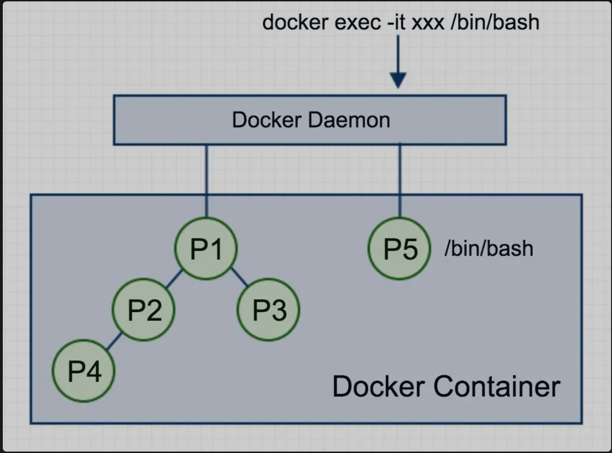

# 前言

线上排查pod 问题一般有两种方式，kubectl log 或者 kubectl exec 调试。如果你的 log 写不够优雅，或者需要排除网络问题必须进容器，就只能 exec 了。
```
# 在pod 123456-7890的容器ruby-container中运行“date”并获取输出
$ kubectl exec 123456-7890 -c ruby-container date
```
kubectl exec 可以执行完命令就退出，或者一直保持终端输入，本质是通过docker(或其他运行时) exec 来实现，本文主要介绍 exec 的实现逻辑，以及如何实现 web-console。
# docker exec
docker exec 的原理，大致概况一句话是：一个进程可以选择加入到某个进程已有的 Namespace 当中，从而达到“进入”这个进程所在容器的目的。



Docker 容器其实就是若干进程构成，容器内 pid为1的进程为容器主进程，如果要加入 exec 运行一个命令，等于是新增一个process为/bin/bash, 其父进程为 Docker Daemon，新的process加入了容器主进程 P1 所在的隔离环境（namespaces），与 P1共享 Network、Mount、IPC 等所有资源，且与该容器内的进程一样受到资源限制（cgroup）。

docker exec加入已有namespace的过程：

```
查看现有容器的 pid
$ docker inspect --format '{{ .State.Pid }}'  4ddf4638572d
25686
```

通过查看宿主机的 proc 文件，看到这个 25686 进程的所有 Namespace 对应的文件， 进程的每种 Linux Namespace，都在它对应的 /proc/{进程号}/ns 下有一个对应的虚拟文件，并且链接到一个真实的 Namespace 文件上。
```
$ ls -l  /proc/25686/ns

lrwxrwxrwx  cgroup -> cgroup:[4026531835]
lrwxrwxrwx  ipc -> ipc:[4026532278]
lrwxrwxrwx  mnt -> mnt:[4026532276]
lrwxrwxrwx  net -> net:[4026532281]
lrwxrwxrwx  pid -> pid:[4026532279]
lrwxrwxrwx  pid_for_children -> pid:[4026532279]
lrwxrwxrwx  user -> user:[4026531837]
lrwxrwxrwx  uts -> uts:[4026532277]
```
要加入25686所在的 namespace，执行的是叫 setns()的 Linux系统调用。
```C
int setns(int fd, int nstype);
```
- fd: 是一个指向一个命名空间的文件描述符，位于/proc/PID/ns/目录。
- nstype: 指定了允许进入的命名空间，设置为0表示允许进入所有命名空间。
```
int main(int argc, char *argv[]) {
    int fd;

    fd = open(argv[1], O_RDONLY);
    if (setns(fd, 0) == -1) {
        errExit("setns");
    }
    execvp(argv[2], &argv[2]); 
    errExit("execvp");
}
```
这段代码的操作就是通过 open() 系统调用打开了指定的 Namespace 文件，并把这个文件的描述符 fd 交给 setns() 使用。在 setns() 执行后，当前进程就加入了这个文件对应的 Linux Namespace 当中了。加入后，可以查看两个pid 的 namespace 是同一个。
```
$ ls -l /proc/28499/ns/net
lrwxrwxrwx  /proc/28499/ns/net -> net:[4026532281]

$ ls -l  /proc/25686/ns/net
lrwxrwxrwx/proc/25686/ns/net -> net:[4026532281]
```
setns 操作是docker exec 的基础，加入 namespace 之后，只需要将 std 通过 stream 暴露接口出去，被上层调用。docker 代码

```
## moby/daemon/exec.go
attachConfig := stream.AttachConfig{
        TTY:        ec.Tty,
        UseStdin:   cStdin != nil,
        UseStdout:  cStdout != nil,
        UseStderr:  cStderr != nil,
        Stdin:      cStdin,
        Stdout:     cStdout,
        Stderr:     cStderr,
        DetachKeys: ec.DetachKeys,
        CloseStdin: true,
    }
    ec.StreamConfig.AttachStreams(&attachConfig)
    attachErr := ec.StreamConfig.CopyStreams(ctx, &attachConfig)

    // Synchronize with libcontainerd event loop
    ec.Lock()
    c.ExecCommands.Lock()
    systemPid, err := d.containerd.Exec(ctx, c.ID, ec.ID, p, cStdin != nil, ec.InitializeStdio)
    // the exec context should be ready, or error happened.
    // close the chan to notify readiness
    close(ec.Started)
```
docker 不仅提供 cli 命令行操作，还提供了 HTTP API，这里面涉及协议转换，类似 websocket连接，后面在 webshell 中会详细描述。
如 docker 中的 Hijacking
```
Upgrade: tcp
Connection: Upgrade
```

# nsenter
进入容器还可以使用nsenter，这是一个小工具，安装后可以在主机上直接执行。
在使用nsenter命令之前需要获取到docker容器的进程，然后再使用nsenter工具进去到docker容器中，具体的使用方法如下：
```
$ docker inspect -f {{.State.Pid}} 容器名或者容器id 
$ nsenter --target 上面查到的进程id --mount --uts --ipc --net --pid 
```
nsenter指令中进程id之后的参数的含义：

- mount参数是进去到mount namespace中
- uts参数是进入到uts namespace中
- ipc参数是进入到System V IPC namaspace中
- net参数是进入到network namespace中
- pid参数是进入到pid namespace中
- user参数是进入到user namespace中

nsenter相当于在setns的示例程序之上做了一层封装，使我们无需指定命名空间的文件描述符，而是指定进程号即可。

nsenter 与 docker exec对比：

- 二者都是 setns, 共享namespace，没什么大的区别
- nsenter 不会进入 cgroup，因此不受资源限制，调试可能更方便，但远程读写还是建议使用 docker exec
- nsenter 出现时间早于docker exec。只适用于 intel 64 位系统，不过正式版docker 也是一样。

# kubectl exec
在k8s中，你可以使用 kubectl exec 来进入 pod 中的容器，如：
```shell script
$ kubectl exec 123456-7890 -c ruby-container date
```

执行kubectl exec时首先会向 apiserver 发起请求，由 apiserver 转发给pod 所在机器上的kubelet进程，然后再转发给 runtime 的exec接口


请求时apiserver 中可以看到这种日志：
```
handler.go:143] kube-apiserver: POST "/api/v1/namespaces/default/pods/exec-test-nginx-6558988d5-fgxgg/exec" satisfied by gorestful with webservice /api/v1
upgradeaware.go:261] Connecting to backend proxy (intercepting redirects) https://192.168.205.11:10250/exec/default/exec-test-nginx-6558988d5-fgxgg/exec-test-nginx?command=sh&input=1&output=1&tty=1
Headers: map[Connection:[Upgrade] Content-Length:[0] Upgrade:[SPDY/3.1] User-Agent:[kubectl/v1.12.10 (darwin/amd64) kubernetes/e3c1340] X-Forwarded-For:[192.168.205.1] X-Stream-Protocol-Version:[v4.channel.k8s.io v3.channel.k8s.io v2.channel.k8s.io channel.k8s.io]]
```
```
HTTP 请求中包含了协议升级的请求. 101 upgrade
SPDY 允许在单个 TCP 连接上复用独立的 stdin/stdout/stderr/spdy-error 流。
```

API Server 收到请求后，找到需要转发的 node 地址，即 nodeip:10255端口，然后开始连接

```go 
// GetConnectionInfo retrieves connection info from the status of a Node API object.
func (k *NodeConnectionInfoGetter) GetConnectionInfo(ctx context.Context, nodeName types.NodeName) (*ConnectionInfo, error) {
        node, err := k.nodes.Get(ctx, string(nodeName), metav1.GetOptions{})
        if err != nil {
                return nil, err
        }

       ....

        return &ConnectionInfo{
                Scheme:    k.scheme,
                Hostname:  host,
                Port:      strconv.Itoa(port),
                Transport: k.transport,
        }, nil
}
....

location, transport, err := pod.ExecLocation(r.Store, r.KubeletConn, ctx, name, execOpts)
        if err != nil {
                return nil, err
        }
        return newThrottledUpgradeAwareProxyHandler(location, transport, false, true, true, responder), nil
```

kubelet 接到 apiserver 的请求后，调用各运行时的RuntimeServiceServer的实现，包括 exec 接口的实现，给 apiserver返回一个连接端点
```
// Exec prepares a streaming endpoint to execute a command in the container.
Exec(context.Context, *ExecRequest) (*ExecResponse, error)
```
最后，容器运行时在工作节点上执行命令，如：
```
if v, found := os.LookupEnv("XDG_RUNTIME_DIR"); found {
                execCmd.Env = append(execCmd.Env, fmt.Sprintf("XDG_RUNTIME_DIR=%s", v))
        }
        var cmdErr, copyError error
        if tty {
                cmdErr = ttyCmd(execCmd, stdin, stdout, resize)
        } else {
                if stdin != nil {
```


kubectl exec 流程完成。

# web-console 实现
无论是 docker exec还是 kubectl exec，都是接口操作，用起来比较麻烦。一般公司都会提供一个交互式的界面进行 exec 操作，称之为web-console，或者叫web-terminal、webshell

web-console基于websocket实现，在浏览器和后端之间建立websocket连接后，将用户在浏览器中输入的命令通过websocket协议发送到后端，后端提前使用kubectl exec 或docker exec进入到容器，将收到的命令从exec进程的stdin写入，命令执行后，再从exec进程的stdout中读取输出，通过websocket协议返回浏览器显示给用户，达到交互的目的。

返回路线：

**浏览器 <------> WebSocket ------> SSH ------> Linux OS**

实现web-console的开源方案有很多，前端一般是xterm.js，主要难点在多租户隔离和权限校验。同时浏览器的以外关闭有可能导致 exec 残留，需要定时清理。
- web-console
- wssh
- KeyBox
- gotty
- GateOne
- dry
- toolbox
- xterm.js
- ttyd

以上方案中，最成熟的是 **GateOne**，其次是 **gotty**

- gateone：cka考试时使用的web shell就是基于gateone实现。含前端，python开发
- gotty：完整的web shell实现，含前端，golang编写，方便二次开发
