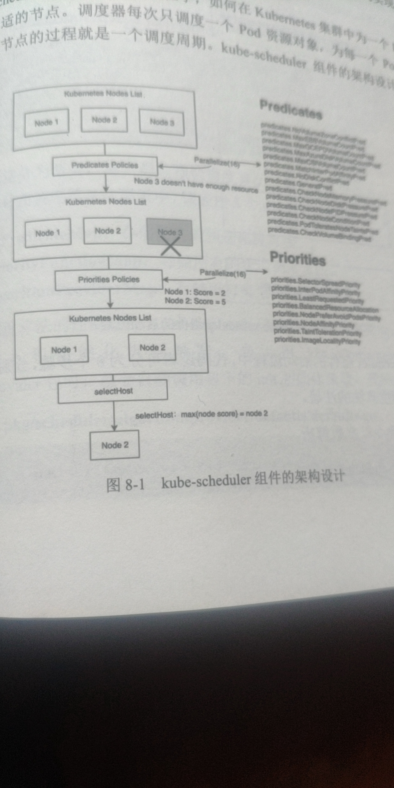
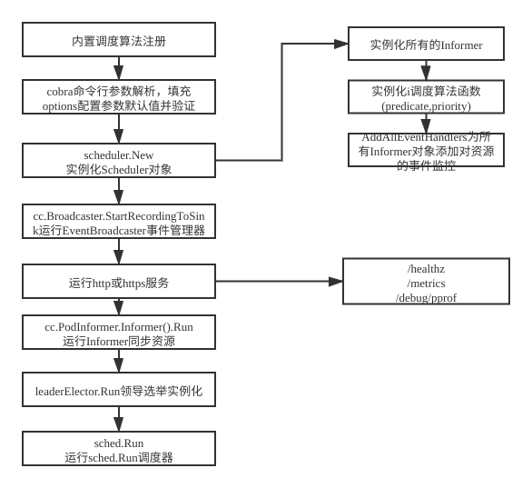
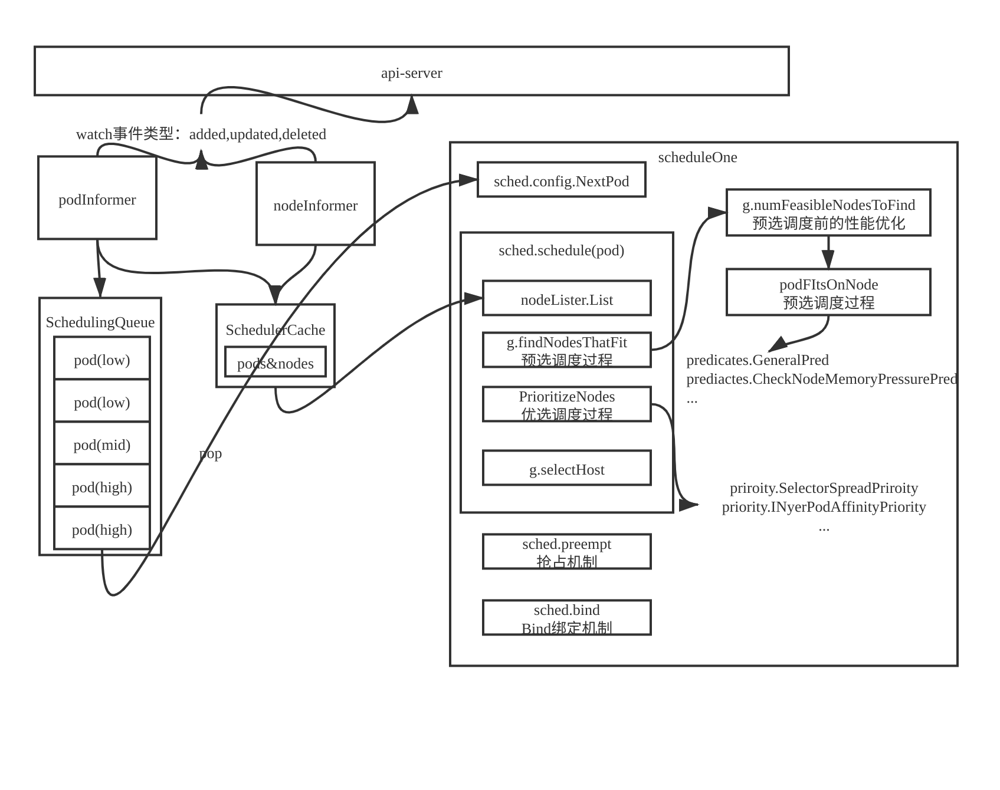

## 前言
kube-scheduler是k8s的默认调度器，其架构设计本身并不复杂，但k8s系统在后期引入了优先级和抢占机制及亲和性调度等功能，kube-scheduler调度器的整体设计略微复杂。

kube-scheduler调度器在为Pod资源对象选择合适的node时，有如下两种最优解。
- 全局最优解：是指每个调度器周期都会遍历k8s集群中的所有节点，以便找出全局最优的节点
- 局部最优解：是指每个调度周期只会遍历部分k8s集群中的节点，找出局部最优节点

全局最优解和局部最优解可以解决调度器在小型和大型k8s集群规模上的性能问题。目前kube-scheduler对两种最优解都支持。当集群中只有几百台主机时，例如100台主机，kube-scheduler使用全局最优解，当集群规模较大，例如其中包含5000多台主机，kube-scheduler使用局部最优解。
具体实现参考”预选调度前的优化“部分。

kube-scheduler组件架构如图:



## kube-scheduler组建的启动流程
如图所示:



按图所示，启动流程分成8步骤，下面分别介绍

## 内置调度算法注册
kube-scheduler组建启动时，将k8s内置的调度算法注册到调度算法注册表中。调度算法注册表与Scheme资源注册表类似，都是通过map数据结构存放，调度算法注册表代码如下

代码路径`pkg/scheduler/factory/plugins.go:79`
```go
var (
	schedulerFactoryMutex sync.Mutex

	// maps that hold registered algorithm types
	fitPredicateMap        = make(map[string]FitPredicateFactory)
	mandatoryFitPredicates = sets.NewString()
	priorityFunctionMap    = make(map[string]PriorityConfigFactory)
	algorithmProviderMap   = make(map[string]AlgorithmProviderConfig)
    ...
)
```
- fitPredicateMap: 存储所有的预选调度算法
- priorityFunctionMap: 存储所有的优选调度算法
- algorithmProviderMap: 存储所有类型的调度算法

内置调度算法注册过程，通过go的导入和初始化机制触发。当 import k8s.io/kubenetes/pkg/scheduler/algorithmprovider包时，自动调用包下的init函数

代码路径`pkg/scheduler/algorithmprovider/defaults/defaults.go`
```go
func init() {
	registerAlgorithmProvider(defaultPredicates(), defaultPriorities())
}
func registerAlgorithmProvider(predSet, priSet sets.String) {
	// Registers algorithm providers. By default we use 'DefaultProvider', but user can specify one to be used
	// by specifying flag.
	factory.RegisterAlgorithmProvider(factory.DefaultProvider, predSet, priSet)
	// Cluster autoscaler friendly scheduling algorithm.
	factory.RegisterAlgorithmProvider(ClusterAutoscalerProvider, predSet,
		copyAndReplace(priSet, priorities.LeastRequestedPriority, priorities.MostRequestedPriority))
}
```
registerAlgorithmProvider函数负责预选调度算法集(defaultPredicates)和优选调度算法集(defaultPriorities)的注册。通过factory.RegisterAlgorithmProvider将两类调度算法注册之algorithmProviderMap中

## cobra命令行参数解析
kube-scheduler组建通过cobra填充Options配置参数默认值并验证参数

代码路径`cmd/kube-scheduler/app/server.go:62`
```go
func NewSchedulerCommand() *cobra.Command {
	opts, err := options.NewOptions()
	if err != nil {
		klog.Fatalf("unable to initialize command options: %v", err)
	}

	cmd := &cobra.Command{
		Use: "kube-scheduler",
		Long: `The Kubernetes scheduler is a policy-rich, topology-aware,
workload-specific function that significantly impacts availability, performance,
and capacity. The scheduler needs to take into account individual and collective
resource requirements, quality of service requirements, hardware/software/policy
constraints, affinity and anti-affinity specifications, data locality, inter-workload
interference, deadlines, and so on. Workload-specific requirements will be exposed
through the API as necessary.`,
		Run: func(cmd *cobra.Command, args []string) {
			if err := runCommand(cmd, args, opts); err != nil {
				fmt.Fprintf(os.Stderr, "%v\n", err)
				os.Exit(1)
			}
		},
	}
	...
}

// runCommand runs the scheduler.
func runCommand(cmd *cobra.Command, args []string, opts *options.Options) error {
	...
	if errs := opts.Validate(); len(errs) > 0 {
		fmt.Fprintf(os.Stderr, "%v\n", utilerrors.NewAggregate(errs))
		os.Exit(1)
	}

	...

	stopCh := make(chan struct{})

	// Get the completed config
	cc := c.Complete()

	...

	return Run(cc, stopCh)
}
```
首先kube-scheduler组件通过options.NewOptions函数初始化各个模块的默认配置，例如http或https服务等，然后通过Validate函数验证配置参数的合法性和可用性，并通过Complete函数填充默认的options配置参数。最后将cc(kube-scheduler组建的运行配置)对象传入Run函数。Run函数定义了组件启动的逻辑，他是一个运行不退出的常驻进程。至此。完成了kube-scheduler组建启动之前的环境配置

## 实例化Scheduler对象
Scheduler对象，它包含了kube-scheduler组件运行过程中那个的所有依赖模块。Scheduler对象实例化过程分为三部分：
1,实例化所有的Informer;2,实例化调度算法函数;3,为所有的Informer对象添加对资源的监控

### 1,实例化所有的Informer
代码路径
`cmd/kube-scheduler/app/server.go：164`->`pkg/scheduler/scheduler.go:121`

```go
sched, err := scheduler.New(...)

// New returns a Scheduler
func New(client clientset.Interface,
	nodeInformer coreinformers.NodeInformer,
	podInformer coreinformers.PodInformer,
	pvInformer coreinformers.PersistentVolumeInformer,
	pvcInformer coreinformers.PersistentVolumeClaimInformer,
	replicationControllerInformer coreinformers.ReplicationControllerInformer,
	replicaSetInformer appsinformers.ReplicaSetInformer,
	statefulSetInformer appsinformers.StatefulSetInformer,
	serviceInformer coreinformers.ServiceInformer,
	pdbInformer policyinformers.PodDisruptionBudgetInformer,
	storageClassInformer storageinformers.StorageClassInformer,
	recorder record.EventRecorder,
	schedulerAlgorithmSource kubeschedulerconfig.SchedulerAlgorithmSource,
	stopCh <-chan struct{},
	opts ...func(o *schedulerOptions)) (*Scheduler, error) {
	...
}
```
kube-scheduler组件依赖多个资源的Informer对象，用于监控相应资源对象的事件。

### 2,实例化调度算法函数
之前的逻辑中，内置调度算法的注册过程中只注册了调度算法的名称，在此处，为已经注册名称的调度算法实例化对应的调度算法函数，有两种方式实例化调度算法函数，他们被称为调度算法源(Scheduler Algorithm Source),代码示例如下：

代码路径`pkg/scheduler/apis/config/types.go：97`
```go
type SchedulerAlgorithmSource struct {
	// Policy is a policy based algorithm source.
	Policy *SchedulerPolicySource
	// Provider is the name of a scheduling algorithm provider to use.
	Provider *string
}
```
- Policy：通过定义好的Policy(策略)资源的方式实例化调度算法函数。该方式可通过--policy-config-file参数指定调度策略文件
- Provider：通用调度器，通过名称的方式实例化调度算法函数，这也是kube-scheduler的默认方式。

代码如下`pkg/scheduler/scheduler.go:162`
```
switch {
	case source.Provider != nil:
		// Create the config from a named algorithm provider.
		sc, err := configurator.CreateFromProvider(*source.Provider)
		if err != nil {
			return nil, fmt.Errorf("couldn't create scheduler using provider %q: %v", *source.Provider, err)
		}
		config = sc
	case source.Policy != nil:
		// Create the config from a user specified policy source.
		policy := &schedulerapi.Policy{}
		switch {
		case source.Policy.File != nil:
			if err := initPolicyFromFile(source.Policy.File.Path, policy); err != nil {
				return nil, err
			}
		case source.Policy.ConfigMap != nil:
			if err := initPolicyFromConfigMap(client, source.Policy.ConfigMap, policy); err != nil {
				return nil, err
			}
		}
		sc, err := configurator.CreateFromConfig(*policy)
		if err != nil {
			return nil, fmt.Errorf("couldn't create scheduler from policy: %v", err)
		}
		config = sc
	default:
		return nil, fmt.Errorf("unsupported algorithm source: %v", source)
	}
```
### 3,为所有的Informer对象添加对资源时间的监控
代码路径`pkg/scheduler/scheduler.go：199`
```go
AddAllEventHandlers(sched, options.schedulerName, nodeInformer, podInformer, pvInformer, pvcInformer, replicationControllerInformer, replicaSetInformer, statefulSetInformer, serviceInformer, pdbInformer, storageClassInformer)
```
AddAllEventHandlers函数为所有的Informer对象添加对资源事件的监控并设置回调函数，以podInformer为例，看下逻辑

代码路径`pkg/scheduler/eventhandlers.go：336`
```go
// unscheduled pod queue
	podInformer.Informer().AddEventHandler(
		cache.FilteringResourceEventHandler{
			FilterFunc: func(obj interface{}) bool {
				switch t := obj.(type) {
				case *v1.Pod:
					return !assignedPod(t) && responsibleForPod(t, schedulerName)
				case cache.DeletedFinalStateUnknown:
					if pod, ok := t.Obj.(*v1.Pod); ok {
						return !assignedPod(pod) && responsibleForPod(pod, schedulerName)
					}
					utilruntime.HandleError(fmt.Errorf("unable to convert object %T to *v1.Pod in %T", obj, sched))
					return false
				default:
					utilruntime.HandleError(fmt.Errorf("unable to handle object in %T: %T", sched, obj))
					return false
				}
			},
			Handler: cache.ResourceEventHandlerFuncs{
				AddFunc:    sched.addPodToSchedulingQueue,
				UpdateFunc: sched.updatePodInSchedulingQueue,
				DeleteFunc: sched.deletePodFromSchedulingQueue,
			},
		},
	)
```
podInformer对象监控Pod资源对象，当该资源触发Add,Update,Delete事件时，触发对应的回调函数。
例如，再触发Add事件，将其放入SchedulingQueue调度队列中，等待kube-scheduler调度器为该Pod资源对象分配节点。

## 运行EventBroadcaster事件管理器
k8s的事件是一种资源对象，用于展示集群内发生的情况，kube-scheduler组件会将运行时产生的各种事件上报api-server。

代码路径`cmd/kube-scheduler/app/server.go：187`
```go
// Prepare the event broadcaster.
	if cc.Broadcaster != nil && cc.EventClient != nil {
		cc.Broadcaster.StartLogging(klog.V(6).Infof)
		cc.Broadcaster.StartRecordingToSink(&v1core.EventSinkImpl{Interface: cc.EventClient.Events("")})
	}
```
cc.Broadcaster通过StartLogging自定义函数将事件输出之klong stdout标准输出，通过StartRecordingToSink自定义函数将关键性事件上报给api-server

## 运行http或https服务
kube-scheduler组建拥有自己的http服务，但功能仅限于监控和监控检查等，其运行原理与kube-apiserver类似，提供如下几个接口：
- /healthz: 用于健康检查
- /metrics: 用于监控指标，一般是prometheus指标采集
- /debug/pprof: 用于pprof性能分析

## 运行Informer同步资源
运行所有已经实例化的Informer对象，代码如下`cmd/kube-scheduler/app/server.go:223`
```go
	// Start all informers.
	go cc.PodInformer.Informer().Run(stopCh)
	cc.InformerFactory.Start(stopCh)

	// Wait for all caches to sync before scheduling.
	cc.InformerFactory.WaitForCacheSync(stopCh)
	controller.WaitForCacheSync("scheduler", stopCh, cc.PodInformer.Informer().HasSynced)

```
通过Informer监控NodeInformer,PodInformer,PersistentVolumeInformer,PersistentVolumeClaimInformer,ReplicationControllerInformer,ReplicaSetInformer,StatefulSetInformer,ServiceInformer,PodDisruptionBudgetInformer,StorageClassInformer资源

在正式启动Scheduler调度器之前，需通过cc.InformerFactory.WaitForCacheSync函数等待所有运行的Informer的数据同步完毕，是本地数据与etcd的数据保持一致

## leader选举
领导选举机制的目的是实现k8s组件高可用。在领导选举实例化的过程中，会定义Callbacks函数

代码路径`cmd/kube-scheduler/app/server.go：248`
```go
// If leader election is enabled, runCommand via LeaderElector until done and exit.
	if cc.LeaderElection != nil {
		cc.LeaderElection.Callbacks = leaderelection.LeaderCallbacks{
			OnStartedLeading: run,
			OnStoppedLeading: func() {
				utilruntime.HandleError(fmt.Errorf("lost master"))
			},
		}
		leaderElector, err := leaderelection.NewLeaderElector(*cc.LeaderElection)
		if err != nil {
			return fmt.Errorf("couldn't create leader elector: %v", err)
		}

		leaderElector.Run(ctx)

		return fmt.Errorf("lost lease")
	}

```
Callbacks中定义了两个函数：OnStartedLeading函数是当前节点领导着选举成功后回调的函数，该函数定义了kube-scheduler组件的主逻辑;OnStoppedLeading函数是当前节点领导者被抢占后回调的函数，在领导者被抢占后，会退出当前的kube-scheduler进程

通过leaderelection.NewLeaderElector函数实例化leaderElector对象，通过leaderElector.Run函数参与领导者选举，该函数会一直尝试使节点成为领导者

## 运行sched.Run调度器
在正式运行kube-scheduler组件主逻辑之前，通过sched.config.WaitForCacheSync()再次确认所有运行的Informer的数据是否已经同步到本地

代码路径`cmd/kube-scheduler/app/server.go:231`->`pkg/scheduler/scheduler.go:248`
```go
// Run begins watching and scheduling. It waits for cache to be synced, then starts a goroutine and returns immediately.
func (sched *Scheduler) Run() {
	if !sched.config.WaitForCacheSync() {
		return
	}

	go wait.Until(sched.scheduleOne, 0, sched.config.StopEverything)
}
```
sched.scheduleOne是kube-scheduler的主逻辑，他通过waitUntil定时器执行，内部会地那是调用sched.scheduleOne函数，当sched.config.StopEverything Chan关闭时，该定时器才会停止并退出

## 调度器运行流程
流程如图所示



kube-scheduler调度器在启动过程中实例化并运行了很多Informer,其中podInformer和nodeInformer用于同步api-server上的资源。podInformer将watch到的Pod资源事件分别存储中调度队列(SchedulingQueue)和调度缓存(SchedulingCache)中。nodeInformer将监控到的node资源时间存储至调度缓存中。
- 调度队列：存储了带调度的Pod资源对象。调度队列的实现方式有两种，分别是FIFO(先入先出队列)和PriorityQueue(优先级队列)。
- 调度缓存：存储了调度过程中使用到的Pod和Node资源信息

scheduleOne函数实现了kube-scheduler调度器的核心逻辑，它的逻辑只要分四步：
- 1，通过sched.config.NextPod函数从优先级队列中获取一个最高的带调度的Pod资源，该过程是阻塞的，当优先级队列中不存在任何Pod资源对象时，该函数处于等待状态
- 2，通过sched.schedule(pod)函数执行预选调度算法和优选调度算法，为pod选择一个合适的节点
- 3,当高优先级的Pod资源对象没有找到合适的节点，调度器会通过sched.preempt函数尝试抢占低优先级的pod资源对象的节点
- 4,当调度器为pod选择了一个合适的节点，通过sched.bind函数将合适的节点与pod绑定在一起