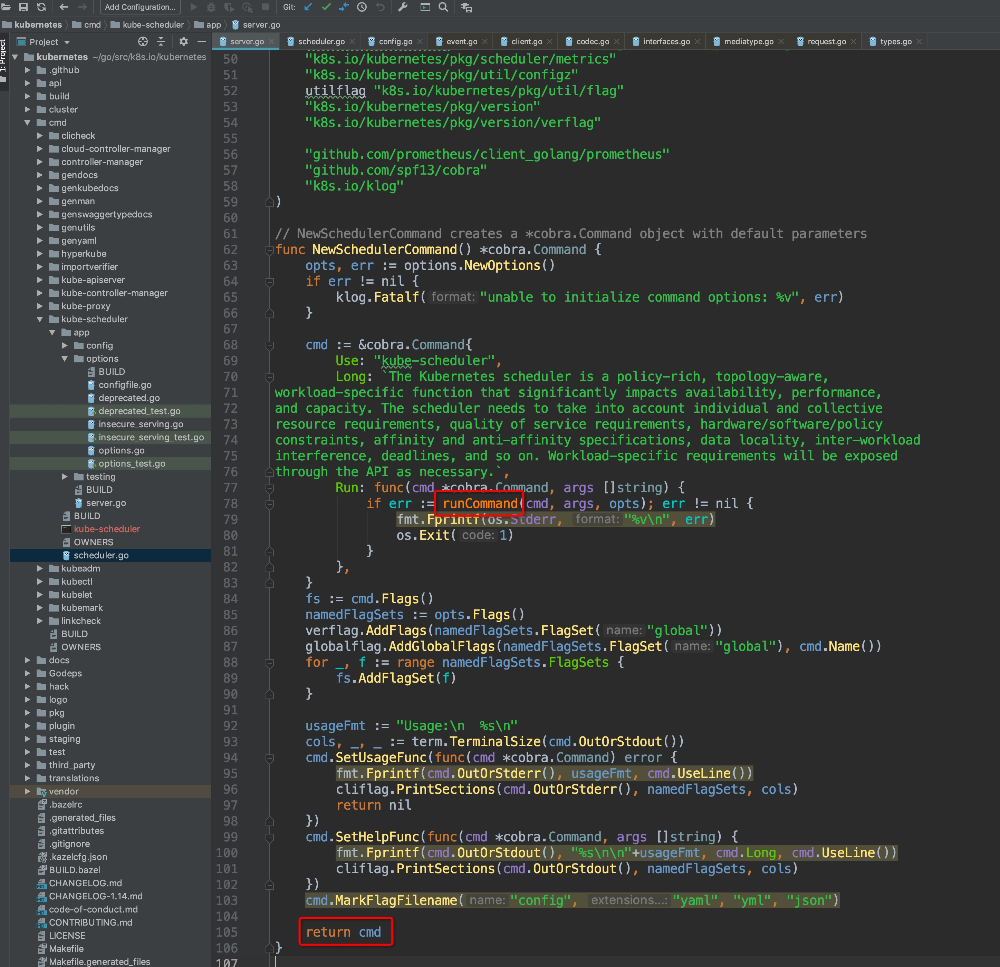
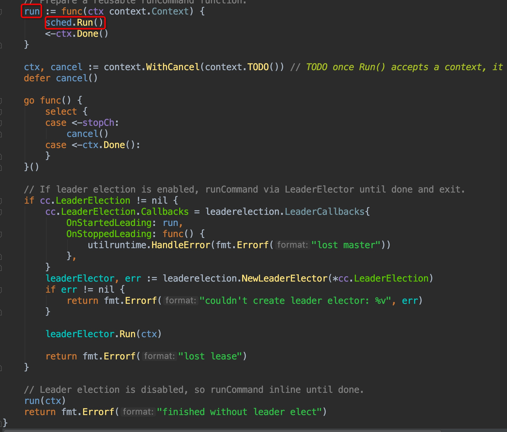
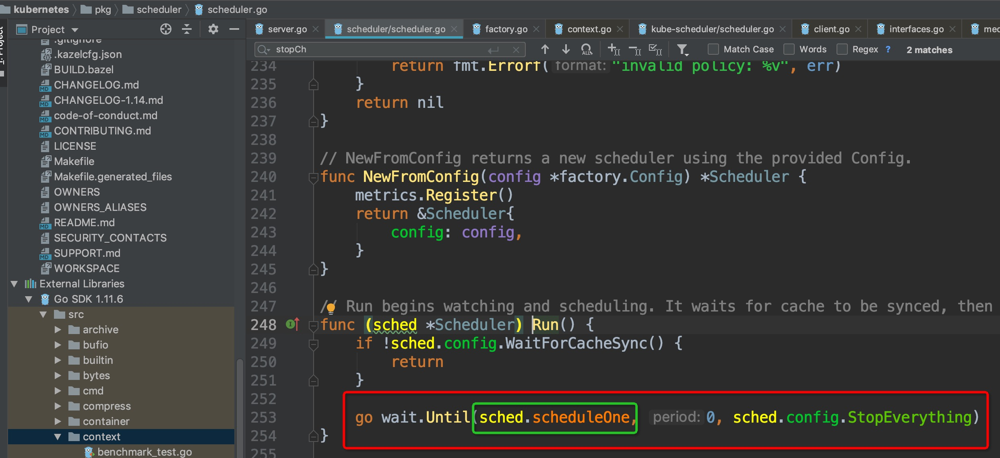
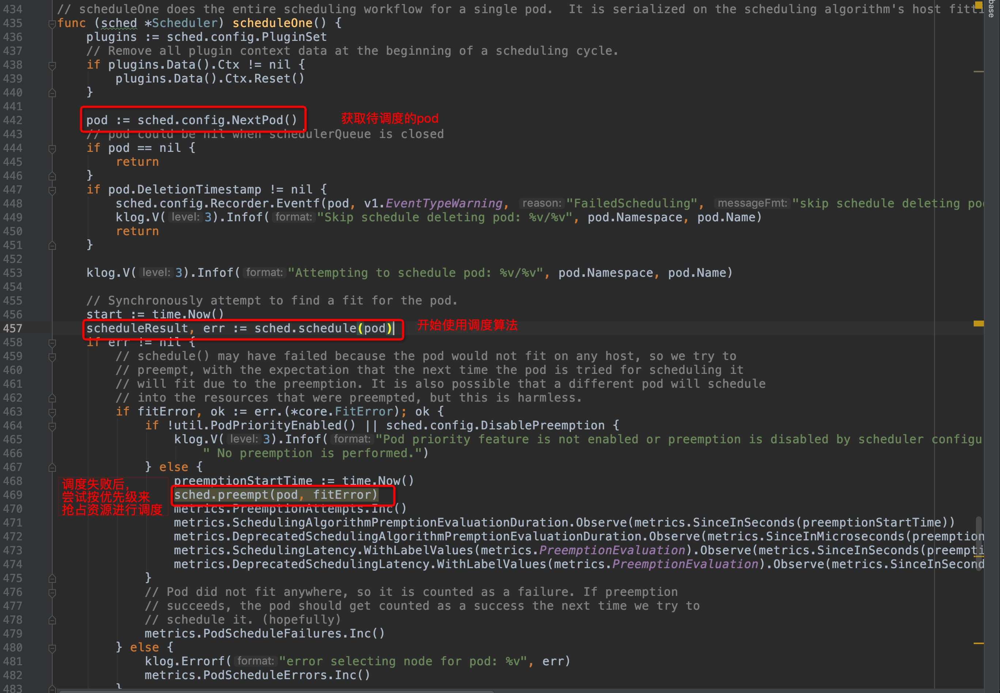

# 调度器入口

## 前言
本篇介绍scheduler的初始化相关逻辑

## 入口之前
入口函数是位于`cmd/kube-scheduler/scheduler.go`中的main()方法,调用的是app.NewSchedulerCommand()方法，跳转至此方法，可以看到函数上方的注释：

```
// NewSchedulerCommand creates a *cobra.Command object with default parameters
func NewSchedulerCommand() *cobra.Command {
    ...
}
```
NewSchedulerCommand创建的是一个cobra.Command对象，后续的命令行处理相关功能都是借助cobra来实现的。

## 入口
通过对上方cobra的基本了解，我们不难知道，`cmd/kube-scheduler/scheduler.go`内的main()方法内部实际调用的是`cobra.Command.Run`内的匿名函数，我们可以进入`NewSchedulerCommand()`内部确认:


可以看到，调用了`Run`内部`runCommand`方法，再来看看Run方法内部需要重点关注的几个点：


其中，上方是对命令行的参数、选项校验的步骤，跳过，重点关注两个变量:`cc和stopCh`，这两个变量会作为最后调用`Run()`方法的参数，其中`stopCh`作用是作为主程序退出的信号通知其他各协程进行相关的退出操作的，另外一个cc变量非常重要，可以点击`c.Complete()`方法，查看该方法的详情：

`Complete()`方法本质上返回的是一个Config结构体，该结构体内部的元素非常丰富，篇幅有限就不一一点开截图了，大家可以自行深入查看这些元素的作用，这里简单概括一下其中几个:

```
// scheduler 本身相关的配置都集中于此，例如名称、调度算法、pod亲和性权重、leader选举机制、metric绑定地址，健康检查绑定地址，绑定超时时间等等
ComponentConfig kubeschedulerconfig.KubeSchedulerConfiguration

// 这几个元素都是与apiserver认证授权相关的
InsecureServing        *apiserver.DeprecatedInsecureServingInfo // nil will disable serving on an insecure port
InsecureMetricsServing *apiserver.DeprecatedInsecureServingInfo // non-nil if metrics should be served independently
Authentication         apiserver.AuthenticationInfo
Authorization          apiserver.AuthorizationInfo
SecureServing          *apiserver.SecureServingInfo

// Clientset.Interface内部封装了向apiServer所支持的所有apiVersion(apps/v1beta2,extensions/v1beta1...)之下的resource(pod/deployment/service...)发起查询请求的功能
Client          clientset.Interface

// 这几个元素都是与Event资源相关的，实现rest api处理以及记录、通知等功能
EventClient     v1core.EventsGetter
Recorder        record.EventRecorder
Broadcaster     record.EventBroadcaster
```
这里层级非常深，不便展示，Config这一个结构体非常重要，可以认真读一读代码。回到`cmd/kube-scheduler/app/server.go`.`runCommand`这里来,接着往下，进入其最后return调用的`Run()`函数中，函数中的前部分都是启动scheduler相关的组件，如event broadcaster、informers、healthz server、metric server等，重点看图中红框圈出的`sched.Run()`,这才是scheduler主程序的调用运行函数:


进入`sched.Run()`:


`wait.Until`这个调用的逻辑是，直到收到stop信号才终止，在此之前循环运行`sched.scheduleOne`。代码走到这里，终于找到启动入口最内部的主体啦:



`sched.scheduleOne`这个函数有代码点长，整体的功能可以概括为:

1.获取需调度的pod

2.使用调度算法寻找匹配node、发起绑定到node请求、绑定检查等一系列操作.

3.若匹配node失败，则尝试根据pod的指定优先级来抢占资源

**本篇入口篇到这里就先告一段落，下一篇开始阅读学习调度过程的逻辑！**
