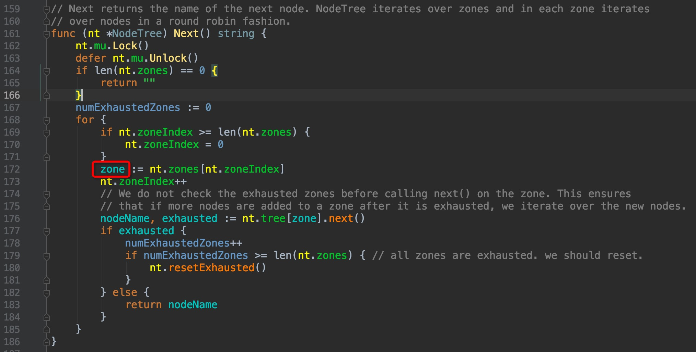
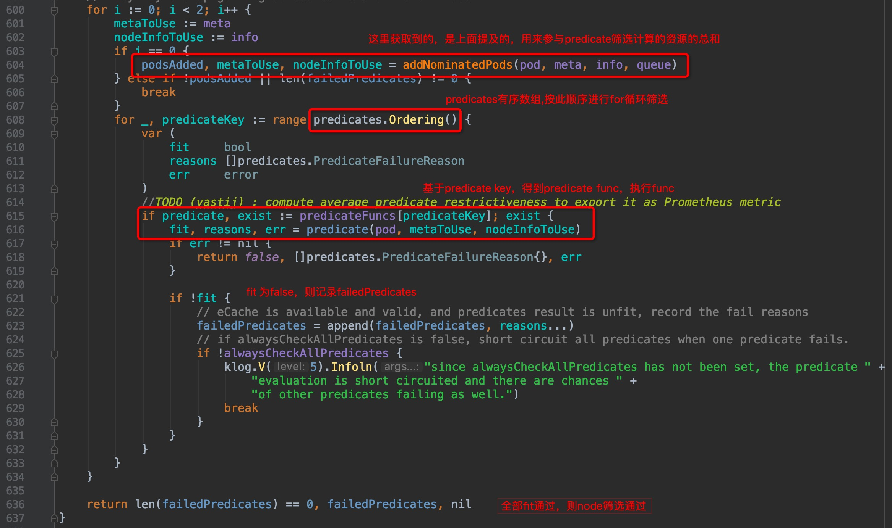
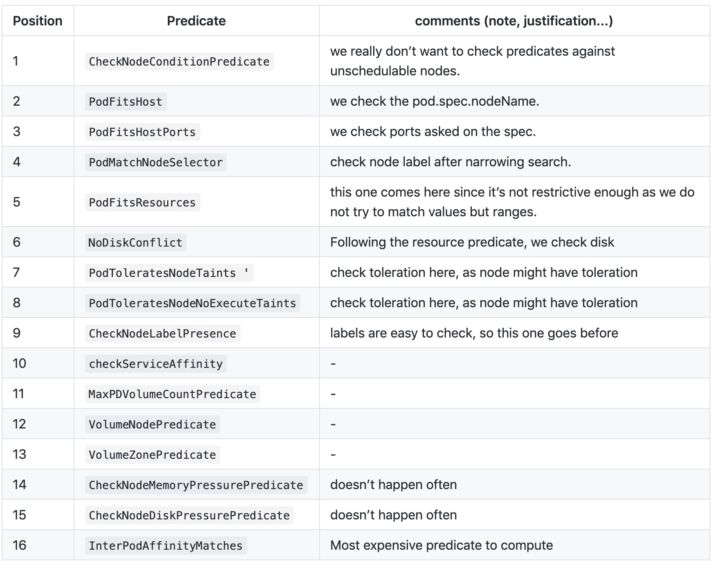

# P3-Node筛选算法

## 前言

在上一篇文档中，我们找到调度器筛选node的算法入口`pkg/scheduler/core/generic_scheduler.go:162` `Schedule()`方法

那么在本篇，由此`Schedule()`函数展开，看一看调度器的node筛选算法，优先级排序算法留作下一篇.

## 正文

### 筛选算法入口

Schedule()的筛选算法核心是`findNodesThatFit()`方法 ,直接跳转过去:

`pkg/scheduler/core/generic_scheduler.go:184` --> `pkg/scheduler/core/generic_scheduler.go:435`

下面注释划出重点，篇幅有限省略部分代码:

```go
func (g *genericScheduler) findNodesThatFit(pod *v1.Pod, nodes []*v1.Node) ([]*v1.Node, FailedPredicateMap, error) {
	var filtered []*v1.Node
	failedPredicateMap := FailedPredicateMap{}

	if len(g.predicates) == 0 {
		filtered = nodes
	} else {
		allNodes := int32(g.cache.NodeTree().NumNodes())
    
    // 筛选的node对象的数量，点击进去可查看详情，当集群规模小于100台时，全部检查，当集群大于100台时，
    // 检查指定比例的机器，若指定比例范围内都没有找到合适的node，则继续查找
		numNodesToFind := g.numFeasibleNodesToFind(allNodes)

		... // 省略

		ctx, cancel := context.WithCancel(context.Background())

		// 负责筛选节点的匿名函数主体，核心实现在于内部的podFitsOnNode函数
		checkNode := func(i int) {
			nodeName := g.cache.NodeTree().Next()
			fits, failedPredicates, err := podFitsOnNode(
				pod,
				meta,
				g.nodeInfoSnapshot.NodeInfoMap[nodeName],
				g.predicates,
				g.schedulingQueue,
				g.alwaysCheckAllPredicates,
			)
			if err != nil {
				predicateResultLock.Lock()
				errs[err.Error()]++
				predicateResultLock.Unlock()
				return
			}
			if fits {
				length := atomic.AddInt32(&filteredLen, 1)
				if length > numNodesToFind {
					cancel()
					atomic.AddInt32(&filteredLen, -1)
				} else {
					filtered[length-1] = g.nodeInfoSnapshot.NodeInfoMap[nodeName].Node()
				}
			} else {
				predicateResultLock.Lock()
				failedPredicateMap[nodeName] = failedPredicates
				predicateResultLock.Unlock()
			}
		}
		
    // 标记一下这里，并发执行筛选，待会儿看看它的并发是怎么设计的
		// Stops searching for more nodes once the configured number of feasible nodes
		// are found.
		workqueue.ParallelizeUntil(ctx, 16, int(allNodes), checkNode)

	// 调度器的扩展处理逻辑，如自定义的扩展筛选、优先级排序算法
	if len(filtered) > 0 && len(g.extenders) != 0 {
	... // 省略
	}
  // 返回结果
	return filtered, failedPredicateMap, nil
}
```

这里一眼就可以看出核心匿名函数内的主体是`podFitsOnNode()`,但是并不是直接执行`podFitsOnNode()`函数，而是又封装了一层函数，这个函数的作用是在外层使用`nodeName := g.cache.NodeTree().Next()`来获取要判断的node主体，传递给`podFitsOnNode()`函数，而后对`podFitsOnNode`函数执行返回的结果进行处理。着眼于其下的并发处理实现:`workqueue.ParallelizeUntil(ctx, 16, int(allNodes), checkNode)`,就可以理解这样封装的好处了,来看看并发实现的内部吧

### 并发控制

`vendor/k8s.io/client-go/util/workqueue/parallelizer.go:38`

```go
func ParallelizeUntil(ctx context.Context, workers, pieces int, doWorkPiece DoWorkPieceFunc) {
	var stop <-chan struct{}
	if ctx != nil {
		stop = ctx.Done()
	}

	toProcess := make(chan int, pieces)
	for i := 0; i < pieces; i++ {
		toProcess <- i
	}
	close(toProcess)

	if pieces < workers {
		workers = pieces
	}

	wg := sync.WaitGroup{}
	wg.Add(workers)
	for i := 0; i < workers; i++ {
		go func() {
			defer utilruntime.HandleCrash()
			defer wg.Done()
			for piece := range toProcess {
				select {
				case <-stop:
					return
				default:
					doWorkPiece(piece)
				}
			}
		}()
	}
	wg.Wait()
}
```

**敲黑板记笔记**:

```
1.chan struct{}是什么鬼? struct{}类型的chan，不占用内存，通常用作go协程之间传递信号，详情可参
考:https://dave.cheney.net/2014/03/25/the-empty-struct

2.ParallelizeUntil函数接收4个参数,分别是父协程上下文,max workers,task number,task执行函数，它启动
指定数量的worker协程，数量最大不超过max workers，共同完成指定数量(task number)的task，每个task执行指
定的执行函数。这意味着，ParallelizeUntil函数只负责并发的数量，而并发的对象主体，需要由task执行函数自行
获取。因此我们看到上面的checkNode匿名函数，内部通过nodeName := g.cache.NodeTree().Next()来获取task
的对象主体，g.cache.NodeTree()对象内部必然维护了一个指针，来获取当前task所需的对象主体。这里使用的并发粒度是以node为单位的.

ParallelizeUntil()的这种实现方式，可以很好地将并发实现和具体功能实现解耦，因此只要功能实现内部处理好指针，
都可以复用ParallelizeUntil()函数来实现并发的控制。
```

来看看`checkNode()`内部是怎样获取每个子协程对应的node主体的:

`pkg/scheduler/core/generic_scheduler.go:460 --> pkg/scheduler/internal/cache/node_tree.go:161`



可以看到，这里有一个zone的逻辑层级，这个层级仿佛没有见过，google了一番才了解了这个颇为冷门的功能：这是一个轻量级的支持集群联邦特性的实现，单个cluster可以属于多个zone，但这个功能目前只有GCE和AWS支持，且绝大多数的使用场景也用不到，可以说是颇为冷门。默认情况下，cluster只属于一个zone，可以理解为cluster和zone是同层级，因此后面见到有关zone相关的层级，我们直接越过它。有兴趣的朋友可以了解一下zone的概念:

https://kubernetes.io/docs/setup/best-practices/multiple-zones/

继续往下, `pkg/scheduler/internal/cache/node_tree.go:176` --> `pkg/scheduler/internal/cache/node_tree.go:47`

```go
// nodeArray is a struct that has nodes that are in a zone.
// We use a slice (as opposed to a set/map) to store the nodes because iterating over the nodes is
// a lot more frequent than searching them by name.
type nodeArray struct {
	nodes     []string
	lastIndex int
}

func (na *nodeArray) next() (nodeName string, exhausted bool) {
	if len(na.nodes) == 0 {
		klog.Error("The nodeArray is empty. It should have been deleted from NodeTree.")
		return "", false
	}
	if na.lastIndex >= len(na.nodes) {
		return "", true
	}
	nodeName = na.nodes[na.lastIndex]
	na.lastIndex++
	return nodeName, false
}
```

果然可以看到, nodeArray结构体内部维护了一个lastIndex指针来获取node，印证了上面的推测。

回到`pkg/scheduler/core/generic_scheduler.go:461`,正式进入`podFitsOnNode`内部:

```go
func podFitsOnNode(
	pod *v1.Pod,
	meta predicates.PredicateMetadata,
	info *schedulernodeinfo.NodeInfo,
	predicateFuncs map[string]predicates.FitPredicate,
	queue internalqueue.SchedulingQueue,
	alwaysCheckAllPredicates bool,
) (bool, []predicates.PredicateFailureReason, error) {
	var failedPredicates []predicates.PredicateFailureReason

	podsAdded := false
	for i := 0; i < 2; i++ {
		metaToUse := meta
		nodeInfoToUse := info
		if i == 0 {
			podsAdded, metaToUse, nodeInfoToUse = addNominatedPods(pod, meta, info, queue)
		} else if !podsAdded || len(failedPredicates) != 0 {
			break
		}
		for _, predicateKey := range predicates.Ordering() {
			var (
				fit     bool
				reasons []predicates.PredicateFailureReason
				err     error
			)
			//TODO (yastij) : compute average predicate restrictiveness to export it as Prometheus metric
			if predicate, exist := predicateFuncs[predicateKey]; exist {
				fit, reasons, err = predicate(pod, metaToUse, nodeInfoToUse)
				if err != nil {
					return false, []predicates.PredicateFailureReason{}, err
				}
			 ... // 省略
			}
		}
	}

	return len(failedPredicates) == 0, failedPredicates, nil
}
```

注释和部分代码已省略,基于`podFitsOnNode`函数内的注释，来做一下说明:

1.通过指定`pod.spec.priority`,来为pod指定调度优先级的功能，在1.14版本已经正式GA，这里所有的调度相关功能都会考虑到pod优先级,因为优先级的原因，因此除了正常的Schedule调度动作外，还会有`Preempt`抢占调度的行为，这个`podFitsOnNode()`方法会被在这两个地方调用。

2.Schedule调度时，会取出当前node上所有已存在的pod，与被提名调度的pod进行优先级对比，取出所有优先级大于等于提名pod，将它们需求的资源加上提名pod所需求的资源，进行汇总，predicate筛选算法计算的时候，是基于这个汇总的结果来进行计算的。举个例子，`node A memory cap = 128Gi`，其上现承载有20个pod，其中10个pod的优先级大于等于提名pod，它们`sum(request.memory) = 100Gi`，若提名pod的`request.memory = 32Gi`, `(100+32) > 128`,因此筛选时会在内存选项失败返回**false**；若提名pod的`request.memory = 16Gi`,`(100+16) < 128`,则内存项筛选通过。那么剩下的优先级较低的10个pod就不考虑它们了吗，它们也要占用内存呀？处理方式是：如果它们占用内存造成node资源不足无法调度提名pod，则调度器会将它们剔出当前node，这即是`Preempt`抢占。Preempt抢占的说明会在后面的文章中补充.

3.对于每个提名pod,其调度过程会被重复执行1次，为什么需要重复执行呢？考虑到有一些场景下，会判断到pod之间的亲和力筛选策略，例如pod A对pod B有亲和性，这时它们一起调度到node上，但pod B此时实际并未完成调度启动，那么pod A的`inter-pod affinity predicates`一定会失败，因此，重复执行1次筛选过程是有必要的.

有了以上理解，我们接着看代码，图中已注释:



图中`pkg/scheduler/core/generic_scheduler.go:608`位置正式开始了逐个计算筛选算法，那么筛选方法、筛选方法顺序在哪里呢？在上一篇[P2-框架篇]([https://github.com/yinwenqin/kubeSourceCodeNote/blob/master/scheduler/P2-%E8%B0%83%E5%BA%A6%E5%99%A8%E6%A1%86%E6%9E%B6.md](https://github.com/yinwenqin/kubeSourceCodeNote/blob/master/scheduler/P2-调度器框架.md))中已经有讲过，默认调度算法都在`pkg/scheduler/algorithm/`路径下，我们接着往下看.

### Predicates  Function

筛选算法相关的`key/func/ordering`，全部集中在`pkg/scheduler/algorithm/predicates/predicates.go`这个文件中

#### 筛选顺序

`pkg/scheduler/algorithm/predicates/predicates.go:142`

```go
// 默认predicate顺序
var (
	predicatesOrdering = []string{CheckNodeConditionPred, CheckNodeUnschedulablePred,
		GeneralPred, HostNamePred, PodFitsHostPortsPred,
		MatchNodeSelectorPred, PodFitsResourcesPred, NoDiskConflictPred,
		PodToleratesNodeTaintsPred, PodToleratesNodeNoExecuteTaintsPred, CheckNodeLabelPresencePred,
		CheckServiceAffinityPred, MaxEBSVolumeCountPred, MaxGCEPDVolumeCountPred, MaxCSIVolumeCountPred,
		MaxAzureDiskVolumeCountPred, MaxCinderVolumeCountPred, CheckVolumeBindingPred, NoVolumeZoneConflictPred,
		CheckNodeMemoryPressurePred, CheckNodePIDPressurePred, CheckNodeDiskPressurePred, MatchInterPodAffinityPred}
)
```

官方的备注:

[链接](https://github.com/kubernetes/community/blob/master/contributors/design-proposals/scheduling/predicates-ordering.md)



#### 筛选key

```go
const (
	// MatchInterPodAffinityPred defines the name of predicate MatchInterPodAffinity.
	MatchInterPodAffinityPred = "MatchInterPodAffinity"
	// CheckVolumeBindingPred defines the name of predicate CheckVolumeBinding.
	CheckVolumeBindingPred = "CheckVolumeBinding"
	// CheckNodeConditionPred defines the name of predicate CheckNodeCondition.
	CheckNodeConditionPred = "CheckNodeCondition"
	// GeneralPred defines the name of predicate GeneralPredicates.
	GeneralPred = "GeneralPredicates"
	// HostNamePred defines the name of predicate HostName.
	HostNamePred = "HostName"
	// PodFitsHostPortsPred defines the name of predicate PodFitsHostPorts.
	PodFitsHostPortsPred = "PodFitsHostPorts"
	// MatchNodeSelectorPred defines the name of predicate MatchNodeSelector.
	MatchNodeSelectorPred = "MatchNodeSelector"
	// PodFitsResourcesPred defines the name of predicate PodFitsResources.
	PodFitsResourcesPred = "PodFitsResources"
	// NoDiskConflictPred defines the name of predicate NoDiskConflict.
	NoDiskConflictPred = "NoDiskConflict"
	// PodToleratesNodeTaintsPred defines the name of predicate PodToleratesNodeTaints.
	PodToleratesNodeTaintsPred = "PodToleratesNodeTaints"
	// CheckNodeUnschedulablePred defines the name of predicate CheckNodeUnschedulablePredicate.
	CheckNodeUnschedulablePred = "CheckNodeUnschedulable"
	// PodToleratesNodeNoExecuteTaintsPred defines the name of predicate PodToleratesNodeNoExecuteTaints.
	PodToleratesNodeNoExecuteTaintsPred = "PodToleratesNodeNoExecuteTaints"
	// CheckNodeLabelPresencePred defines the name of predicate CheckNodeLabelPresence.
	CheckNodeLabelPresencePred = "CheckNodeLabelPresence"
	// CheckServiceAffinityPred defines the name of predicate checkServiceAffinity.
	CheckServiceAffinityPred = "CheckServiceAffinity"
	// MaxEBSVolumeCountPred defines the name of predicate MaxEBSVolumeCount.
	// DEPRECATED
	// All cloudprovider specific predicates are deprecated in favour of MaxCSIVolumeCountPred.
	MaxEBSVolumeCountPred = "MaxEBSVolumeCount"
	// MaxGCEPDVolumeCountPred defines the name of predicate MaxGCEPDVolumeCount.
	// DEPRECATED
	// All cloudprovider specific predicates are deprecated in favour of MaxCSIVolumeCountPred.
	MaxGCEPDVolumeCountPred = "MaxGCEPDVolumeCount"
	// MaxAzureDiskVolumeCountPred defines the name of predicate MaxAzureDiskVolumeCount.
	// DEPRECATED
	// All cloudprovider specific predicates are deprecated in favour of MaxCSIVolumeCountPred.
	MaxAzureDiskVolumeCountPred = "MaxAzureDiskVolumeCount"
	// MaxCinderVolumeCountPred defines the name of predicate MaxCinderDiskVolumeCount.
	// DEPRECATED
	// All cloudprovider specific predicates are deprecated in favour of MaxCSIVolumeCountPred.
	MaxCinderVolumeCountPred = "MaxCinderVolumeCount"
	// MaxCSIVolumeCountPred defines the predicate that decides how many CSI volumes should be attached
	MaxCSIVolumeCountPred = "MaxCSIVolumeCountPred"
	// NoVolumeZoneConflictPred defines the name of predicate NoVolumeZoneConflict.
	NoVolumeZoneConflictPred = "NoVolumeZoneConflict"
	// CheckNodeMemoryPressurePred defines the name of predicate CheckNodeMemoryPressure.
	CheckNodeMemoryPressurePred = "CheckNodeMemoryPressure"
	// CheckNodeDiskPressurePred defines the name of predicate CheckNodeDiskPressure.
	CheckNodeDiskPressurePred = "CheckNodeDiskPressure"
	// CheckNodePIDPressurePred defines the name of predicate CheckNodePIDPressure.
	CheckNodePIDPressurePred = "CheckNodePIDPressure"

	// DefaultMaxGCEPDVolumes defines the maximum number of PD Volumes for GCE
	// GCE instances can have up to 16 PD volumes attached.
	DefaultMaxGCEPDVolumes = 16
	// DefaultMaxAzureDiskVolumes defines the maximum number of PD Volumes for Azure
	// Larger Azure VMs can actually have much more disks attached.
	// TODO We should determine the max based on VM size
	DefaultMaxAzureDiskVolumes = 16

	// KubeMaxPDVols defines the maximum number of PD Volumes per kubelet
	KubeMaxPDVols = "KUBE_MAX_PD_VOLS"

	// EBSVolumeFilterType defines the filter name for EBSVolumeFilter.
	EBSVolumeFilterType = "EBS"
	// GCEPDVolumeFilterType defines the filter name for GCEPDVolumeFilter.
	GCEPDVolumeFilterType = "GCE"
	// AzureDiskVolumeFilterType defines the filter name for AzureDiskVolumeFilter.
	AzureDiskVolumeFilterType = "AzureDisk"
	// CinderVolumeFilterType defines the filter name for CinderVolumeFilter.
	CinderVolumeFilterType = "Cinder"
)
```

#### 筛选Function

每个`predicate key`对应的`function name`一般为`${KEY}Predicate`,function的内容其实都比较简单,不一一介绍了，自行查看，这里仅列举一个:

`pkg/scheduler/algorithm/predicates/predicates.go:1567`

```go
// CheckNodeMemoryPressurePredicate checks if a pod can be scheduled on a node
// reporting memory pressure condition.
func CheckNodeMemoryPressurePredicate(pod *v1.Pod, meta PredicateMetadata, nodeInfo *schedulernodeinfo.NodeInfo) (bool, []PredicateFailureReason, error) {
	var podBestEffort bool
	if predicateMeta, ok := meta.(*predicateMetadata); ok {
		podBestEffort = predicateMeta.podBestEffort
	} else {
		// We couldn't parse metadata - fallback to computing it.
		podBestEffort = isPodBestEffort(pod)
	}
	// pod is not BestEffort pod
	if !podBestEffort {
		return true, nil, nil
	}

	// check if node is under memory pressure
	if nodeInfo.MemoryPressureCondition() == v1.ConditionTrue {
		return false, []PredicateFailureReason{ErrNodeUnderMemoryPressure}, nil
	}
	return true, nil, nil
}
```

筛选算法过程到这里就已然清晰明了！

## 重点回顾

筛选算法代码中的几个不易理解的点(亮点?)圈出:

- **node粒度的并发控制**
- **基于优先级的pod资源总和归纳计算**
- **筛选过程重复1次**


本篇调度器筛选算法篇到此结束，下一篇将学习调度器优先级排序的算法详情内容
