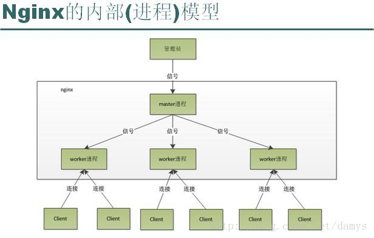

## nginx是如何实现高并发的
一个主进程，多个工作进程，每个工作进程可以处理多个请求
每进来一个request，会有一个worker进程去处理。但不是全程的处理，处理到可能发生阻塞的地方，比如向上游（后端）服务器转发request，并等待请求返回。那么，这个处理的worker继续处理其他请求，而一旦上游服务器返回了，就会触发这个事件，worker才会来接手，这个request才会接着往下走。
由于web server的工作性质决定了每个request的大部份生命都是在网络传输中，实际上花费在server机器上的时间片不多。这是几个进程就解决高并发的秘密所在。即@skoo所说的webserver刚好属于网络io密集型应用，不算是计算密集型。

## nginx工作过程

1.在nginx启动后，会有一个master进程和多个worker进程，master进程主要用来管理worker进程，包括：接受信号，将信号分发给worker进程，监听worker进程工作状态，当worker进程退出时(非正常)，启动新的worker进程。基本的网络事件会交给worker进程处理。多个worker进程之间是对等的，他们同等竞争来自客户端的请求，各进程互相之间是独立的 。一个请求，只可能在一个worker进程中处理，一个worker进程，不可能处理其它进程的请求。 worker进程的个数是可以设置的，一般我们会设置与机器cpu核数一致，这里面的原因与nginx的进程模型以及事件处理模型是分不开的 。

2.当master接收到重新加载的信号会怎么处理(./nginx -s reload)?，master会重新加载配置文件，然后启动新的进程，使用的新的worker进程来接受请求，并告诉老的worker进程他们可以退休了，老的worker进程将不会接受新的，老的worker进程处理完手中正在处理的请求就会退出。

3.worker进程是如何处理用户的请求呢？首先master会根据配置文件生成一个监听相应端口的socket，然后再faster出多个worker进程，这样每个worker就可以接受从socket过来的消息（其实这个时候应该是每一个worker都有一个socket，只是这些socket监听的地址是一样的）。当一个连接过来的时候，每一个worker都能接收到通知，但是只有一个worker能和这个连接建立关系，其他的worker都会连接失败，这就是所谓的惊群现在，为了解决这个问题，nginx提供一个共享锁accept_mutex，有了这个共享锁后，就会只有一个worker去接收这个连接。当一个worker进程在accept这个连接之后，就开始读取请求，解析请求，处理请求，产生数据后，再返回给客户端，最后才断开连接，这样一个完整的请求就是这样的了。

## nginx的事件驱动机制
为什么几个worker进程（每一个worker进程里面其实只有一个主线程）能同时接收上万的请求呢？这是因为nginx事件处理机制是异步非阻塞的。nginx将一个请求划分为多个阶段来异步处理模块，每个阶段只是处理请求的一部分，如果请求的这一部分发生阻塞，nginx不会等待，它会处理其他的请求的某一部分。传统web服务器的每个事件消费者独占一个进程(线程)资源,这种情况对于用户规模较小的情况来说,用户响应速度快,但是当并发规模达到数十万上百万的时候,由于线程(进程)数目过多,会频繁的切换,而且当线程阻塞的时候会进行睡眠,也会造成资源的浪费,这样服务器就会产生瓶颈.

nginx服务器采用的事件驱动机制不同,他不会为每个消费事件创建一个进程或线程,这样就不会产生由于进程间频繁切换占用cpu而产生的瓶颈,而且nginx不会让事件阻塞,即采用无阻塞事件驱动模型,这样就不会因为事件阻塞使进程睡眠而造成的资源浪费.

nginx将一个请求划分成多个阶段异步处理,每个阶段仅仅完成一个请求中的一部分,当本阶段任务完成后进入下一阶段.等待事件发生不是阻塞的等待,等待事件发生时候内。

事件发生源产生事件->事件收集器来收集分发事件(选择自己感兴趣的)->消费事件.

## epoll库
epoll库是Nginx服务器支持的高性能事件驱动库之一。它是公认的最好的事件驱动模型。和poll库及select库有很大的区别。

poll和select都是创建一个待处理事件列表，然后把这个列表发给内核，返回的时候，再去轮询检查这个列表。以判断这个事件是否发生。在描述符太多的情况下，就会明显效率低下了。

epoll是这么做的，它把事件描述符列表的管理交给内核复制。一旦有某个事件发生，内核将发生事件的事件描述符交给Nginx的进程，而不是将整个事件描述符列表交给进程，让进程去轮询具体是哪个描述符。epoll()避免了轮询整个事件描述符列表。所以显得更高效。

epoll库的基本步骤：

首先:epoll库通过相关调用通知内核创建一个有N个描述符的事件列表。然后给这个事件列表设置自己关心的事件。并把它添加到内核中。在具体的代码中还可以实现对相关调用的事件描述符列表进行修改和删除。

之后，一旦设置完成就一直等待内核通知事件发生了，某一事件发生后，内核就将发生事件的描述符给epoll库，epoll库去处理事件。